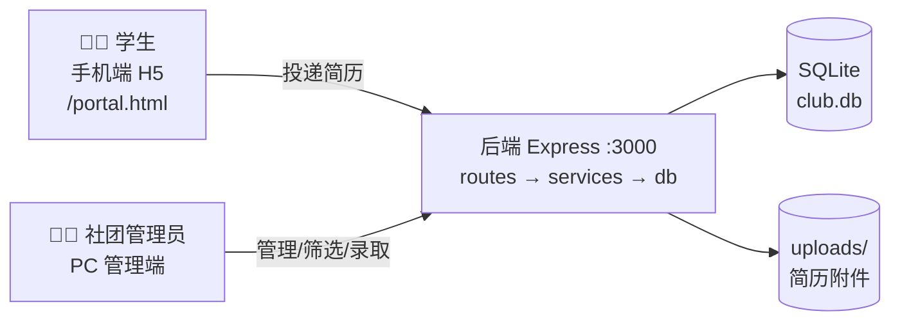

# Community · 社团招新系统

高校社团招新管理平台：社团资料在线维护 + 学生简历归档分类 + 智能匹配 + 数据看板。

- **社团端**：社团名称 / 规模 / 说明 / 招新需求 / 招新人数 的维护；简历归档，支持**按需求**与**按类型**分类；技能标签**智能匹配**（简历↔岗位匹配度、转岗建议）。
- **数据看板**：核心指标 / 招新漏斗 / 岗位进度 / 类型与年级分布 / 投递趋势图表，可按社团与时间范围查看。
- **技术栈**：Vue 3 + Element Plus + ECharts（web/） · Express + better-sqlite3（server/）
- **协议**：MIT（本仓库 LICENSE）

## 系统总览



> 📘 **新手建议先看**：[docs/BEGINNER_GUIDE.md](docs/BEGINNER_GUIDE.md)
> —— 含结构图、时序图、数据流详解、部署拓扑与术语词典，零基础可读。

## 仓库结构

```
community/
├─ docs/
│  ├─ BEGINNER_GUIDE.md # 新手完全指南（结构图/时序图/数据流/部署拓扑）
│  ├─ ARCHITECTURE.md   # 架构设计与里程碑
│  ├─ DATA_MODEL.md     # 数据模型 + SQL DDL
│  ├─ API.md            # REST API 设计
│  └─ DEPLOY.md         # 部署指南
├─ server/              # Express API（M1-M2 ✅）
├─ web/                 # Vue3 前端（M3-M4 ✅）+ public/ 学生端 H5
├─ Dockerfile           # 多阶段构建（前端 + 后端）
├─ docker-compose.yml   # 一键部署
├─ README.md
└─ LICENSE              # MIT
```

## 快速开始

> 详见 [docs/ARCHITECTURE.md](docs/ARCHITECTURE.md)。当前开发进度见文末。

### 后端（server）
```bash
cd server
npm install
npm run dev        # http://localhost:3000
# 首次启动自动执行 db/migrations 建库
```

### 前端（web）
```bash
cd web
npm install
npm run dev        # http://localhost:5173（已配置 /api 代理到 3000）
```

### 生产模式 / Docker
```bash
# 方式一：单端口（先构建前端，后端自动托管）
cd web && npm run build && cd ../server && npm install && node src/index.js
# → http://localhost:3000

# 方式二：Docker（推荐）
docker compose up -d --build
# → http://localhost:3000
```
详见 [docs/DEPLOY.md](docs/DEPLOY.md)。

### 冒烟测试
```bash
curl http://localhost:3000/api/v1/clubs
curl http://localhost:3000/healthz
```

### 页面入口（浏览器打开 http://localhost:5173 开发 / :3000 生产）
- **数据看板**：`/dashboard` —— 招新数据看板（核心指标/漏斗/进度/分布/趋势）
- **社团端（录入与管理）**：
  - `/clubs` —— 社团列表（新建/进入管理）
  - `/clubs/:id` —— 社团详情：资料编辑 + 招新批次 + 岗位需求管理（含期望技能标签）
  - `/applications` —— 简历库：筛选、状态流转、评分备注、归档、CSV 导出、技能匹配推荐与一键转投
  - `/match` —— 智能匹配：简历→岗位匹配度排序、社团内"转岗再推荐"
- **学生投递端（独立 H5）**：`/portal.html` —— 手机风格界面：选社团/岗位 → 按社团类型定制模板填简历 → **真实投递入库**，可查看投递进度

### 学生端说明
- 入口：管理端侧边栏底部「📱 学生投递端」，或直接访问 `/portal.html`
- **数据落库**：投递经 `POST /api/v1/resumes` + `POST /api/v1/positions/:id/applications` 真实写入 SQLite，社团端简历库立即可见（服务重启不丢）
- 本地缓存（localStorage）：学生档案与投递记录索引；投递状态每次从服务端拉最新
- 简历模板：按社团分类（技术/文艺/组织/体育/学术/公益）自动生成字段（后端暂无模板表）
- 设计原则：简历整理只做格式规范与建议，**不篡改学生真实经历**

## 开发进度

| 里程碑 | 状态 |
|---|---|
| M0-M6 基础系统 | ✅ |
| 智能匹配（技能标签 + match API + 推荐 UI） | ✅ |
| 数据看板（指标/漏斗/分布/趋势 + 导航分区） | ✅ |
| 学生投递端整合（H5 + 适配层，真实落库） | ✅ |
| M5 认证权限（JWT） | ⏸ 暂缓（上线前必须启用） |
