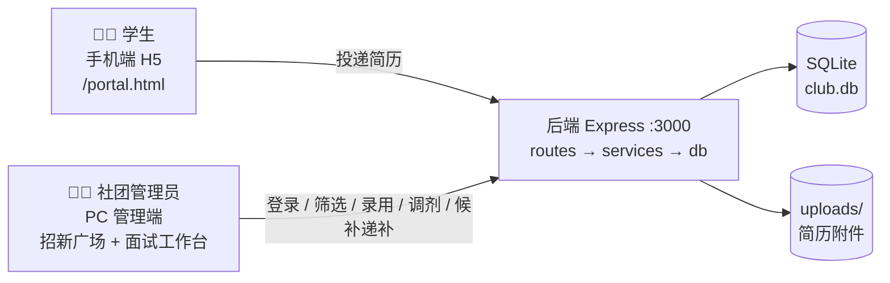

# Community · 社团招新系统

高校社团招新管理平台：招新广场总览 + 社团资料在线维护 + 学生简历归档分类 + 智能匹配 + 面试决策 + 数据看板。

- **招新广场**（默认首页 `/square`）：**双面板** —— 左「全校社团总览」可随时查看任意社团的招新情况与投递人数；右「我的社团」登录后可维护本社团的**信息录入标准**与**投递时间**。
- **社团端**：社团名称 / 规模 / 说明 / 招新需求 / 招新人数 的维护；简历归档，支持**按需求**与**按类型**分类；技能标签**智能匹配**（简历↔岗位匹配度、转岗建议）；**面试决策**（录用 / 调剂 / 候补序号 1 号、2 号…）与**候补递补招满员**。
- **按人权限**：一个社团可以有多个账号（**社长 / 面试官 / 观察员**），能力矩阵不同，前端据此隐藏按钮、后端逐条拦截。
- **数据看板**：核心指标 / 招新漏斗 / 岗位进度 / 类型与年级分布 / 投递趋势图表，可按社团与时间范围查看。
- **技术栈**：Vue 3 + Element Plus + ECharts（web/） · Express + better-sqlite3（server/）
- **协议**：MIT（本仓库 LICENSE）

## 系统总览



> 📘 **新手建议先看**：[docs/BEGINNER_GUIDE.md](docs/BEGINNER_GUIDE.md)
> —— 含结构图、时序图、数据流详解、部署拓扑与术语词典，零基础可读。

## 仓库结构

```
community/
├─ docs/
│  ├─ BEGINNER_GUIDE.md # 新手完全指南（结构图/时序图/数据流/部署拓扑）
│  ├─ ARCHITECTURE.md   # 架构设计与里程碑
│  ├─ DATA_MODEL.md     # 数据模型 + SQL DDL
│  ├─ API.md            # REST API 设计
│  └─ DEPLOY.md         # 部署指南
│  └─ DEPLOY_CLOUD.md   # ☁️ 上云部署（买服务器 → 一键部署 → 搬数据）
├─ server/              # Express API（M1-M2 ✅）
│  ├─ db/migrations/    # 001~004 建库/升级脚本（004 = 社团端改造）
│  ├─ src/routes/       # 含 authRoutes / squareRoutes / decisionRoutes
│  ├─ src/services/     # 含 authService / squareService / decisionService
│  ├─ scripts/          # check-migration / smoke-club-console / cleanup-smoke
│  └─ data/             # club.db + initial-accounts.txt（已 gitignore，不进仓库）
├─ web/                 # Vue3 前端（M3-M4 ✅）+ public/ 学生端 H5
│  ├─ src/views/        # SquareView（招新广场·双面板）/ InterviewView（面试与录用工作台）
│  ├─ src/components/   # EChart.vue / LoginDialog.vue（社团账号登录弹窗）
│  └─ src/stores/       # auth.js（社团端登录态：token + 角色能力清单）
├─ Dockerfile           # 多阶段构建（前端 + 后端）
├─ docker-compose.yml   # 一键部署
├─ README.md
└─ LICENSE              # MIT
```

## 快速开始

> 详见 [docs/ARCHITECTURE.md](docs/ARCHITECTURE.md)。当前开发进度见文末。

### 后端（server）
```bash
cd server
npm install
npm run dev        # http://localhost:3000
# 首次启动自动执行 db/migrations 建库
```

### 前端（web）
```bash
cd web
npm install
npm run dev        # http://localhost:5173（已配置 /api 代理到 3000）
```

### 生产模式 / Docker
```bash
# 方式一：单端口（先构建前端，后端自动托管）
cd web && npm run build && cd ../server && npm install && node src/index.js
# → http://localhost:3000

# 方式二：Docker（推荐）
docker compose up -d --build
# → http://localhost:3000
```
详见 [docs/DEPLOY.md](docs/DEPLOY.md)。

### ☁️ 部署到公网（推荐：香港轻量服务器）

想让同学随时打开、不再依赖你自己的电脑，见 **[docs/DEPLOY_CLOUD.md](docs/DEPLOY_CLOUD.md)**——
从买服务器到上线只需三步：

```bash
# 1) 在服务器上（Ubuntu）克隆并一键部署（自动装 Docker、生成强密码、起服务、配每日备份）
git clone --depth 1 https://github.com/LLLDIOT/community.git /opt/community
bash /opt/community/deploy/provision.sh

# 2) 在本机导出数据
cd server && npm run data:export

# 3) 上传后在服务器导入（先 docker compose down）
scp -r server/export-* root@<服务器IP>:/root/
# 服务器上：cd /opt/community/server && npm run data:import -- --from /root/export-xxx --force
```

> ⚠️ 公网部署前请确认已了解 [安全须知](docs/DEPLOY_CLOUD.md#6-安全须知重要)：
> 全站密码必须开启、简历接口必须保持登录保护、学生端无法防冒名投递。

### 冒烟测试
```bash
curl http://localhost:3000/api/v1/clubs
curl http://localhost:3000/healthz

# 社团端改造：端到端冒烟测试（脚本内共 101 项断言，全通过为合格；
# 其中跨社团隔离、调剂等少数用例需要数据满足条件（社团数 > 1、岗位数 > 1）才会执行）
cd server && npm run smoke            # 等价于 node scripts/smoke-club-console.mjs
# 覆盖全链路：招新广场 → 账号登录 → 录入标准/投递时间 → 面试工作台
#   → 决策（含状态机拦截/撤销）→ 调剂（含匹配建议）→ 候补 1号/2号
#   → 递补招满员 → 权限矩阵（viewer 被拒、跨社团被拒、未登录被拒、
#     以及学生端投递入口保持开放）→ 字典 → 简历库结论筛选/统计/CSV 导出
# 自建临时简历与投递，跑完自动清理，并把被改动的真实社团字段还原

# 辅助脚本
cd server && npm run migrate          # 只跑数据库迁移并打印当前表结构
cd server && npm run account:reset    # 列出社团账号；加 --club 社团名 可重置社长密码
```
辅助脚本：`node scripts/check-migration.mjs`（只跑数据库迁移）、`node scripts/cleanup-smoke.mjs`（清理测试残留）。

### 页面入口（浏览器打开 http://localhost:5173 开发 / :3000 生产）
> 访问根路径 `/` 会**默认跳转到 `/square` 招新广场**（旧版默认首页是 `/dashboard`）。

- **招新广场（默认首页）**：`/square` —— **双面板**
  - 左「全校社团总览」：搜索 / 分类 / 阶段（招新中、已截止·未开始）/ 排序（按投递人数、规模、名称）；社团卡片显示招新阶段、投递人数、已录/名额、岗位数、招满率与候补人数；**点击任意卡片**弹出该社团的招新情况详情（指标、信息录入标准、近 N 天投递趋势、批次与岗位进度表）
  - 右「我的社团」：未登录显示登录卡（可按账号名登录，也可按社团登录）；登录后显示本社团实况统计、**信息录入标准**与**投递时间**编辑表单、岗位招满进度、快捷入口，以及「账号与权限」入口
- **面试与录用工作台**：`/interview` —— 汇总条（候选总数/已录用/候补中/已调剂/未决定/已录需求/还缺/招满率）+ 岗位招满进度与递补按钮 + 筛选（批次/岗位/关键词/只看未决定）+ 候选人看板分列（新收到/待筛选/面试中/已录取/已淘汰·归档）；卡片可直接标注 **录用 / 候补 N 号 / 调剂 / 淘汰 / 撤销**，并显示技能匹配度、评分与命中技能
- **数据看板**：`/dashboard` —— 招新数据看板（核心指标/漏斗/进度/分布/趋势）
- **社团端（录入与管理）**：
  - `/clubs` —— 社团列表（新建/进入管理）
  - `/clubs/:id` —— 社团详情：资料编辑 + 招新批次 + 岗位需求管理（含期望技能标签）
  - `/applications` —— 简历库：筛选、状态流转、评分备注、归档、CSV 导出、技能匹配推荐与一键转投；本轮新增「面试结论」列与结论筛选/统计条（录用/候补/调剂/淘汰/未决定），CSV 增加「面试结论/候补序号/调剂去向」三列
  - `/match` —— 智能匹配：简历→岗位匹配度排序、社团内"转岗再推荐"
- **学生投递端（独立 H5）**：`/portal.html` —— 手机风格界面：选社团/岗位 → 按社团类型定制模板填简历 → **真实投递入库**，可查看投递进度

### 学生端说明
- 入口：管理端侧边栏底部「📱 学生投递端」，或直接访问 `/portal.html`
- **数据落库**：投递经 `POST /api/v1/resumes` + `POST /api/v1/positions/:id/applications` 真实写入 SQLite，社团端简历库立即可见（服务重启不丢）
- 本地缓存（localStorage）：学生档案与投递记录索引；投递状态每次从服务端拉最新
- 简历模板：按社团分类（技术/文艺/组织/体育/学术/公益）自动生成字段（后端暂无模板表）
- 设计原则：简历整理只做格式规范与建议，**不篡改学生真实经历**

### 社团端初始账号（首次启动自动生成）
- **自动播种**：后端首次启动时，会给**还没有任何账号的社团**自动创建一个**社长（owner）账号**，账号形如 `owner_xxxxxx`（`xxxxxx` 为社团 id 后 6 位），口令为随机生成的 8 位字符串。
- **在哪里看**：账密会同时打印在后端启动日志里，并写入 **`server/data/initial-accounts.txt`**。该目录已在 `.gitignore` 中忽略（`server/data/`），**不会进仓库**，只在本机可见。
- **登录入口**：管理端左下角「🔑 登录社团账号」，或「招新广场 → 我的社团」面板里的登录卡；支持**按账号名登录**（也可直接填**社团名**）和**按社团登录**两种方式。
- **登录后能做什么**：在「我的社团 → 账号与权限」里**新建面试官（interviewer）/ 观察员（viewer）账号**、修改角色、停用/删除账号、重置他人密码，以及**修改自己的密码**（改完会强制下线重新登录）。
- 角色能力：**社长**=全部（含社团资料、批次岗位、账号管理）；**面试官**=查看 + 面试决策；**观察员**=只读查看。
- **忘记密码**：`cd server && npm run account:reset -- --club 社团名`（重置社长密码；加 `--password 新密码` 可指定）。
  注意 `initial-accounts.txt` 是**追加**写入的，同一社团可能有多行历史记录，**以最新一条为准**。

## 开发进度

| 里程碑 | 状态 |
|---|---|
| M0-M6 基础系统 | ✅ |
| 智能匹配（技能标签 + match API + 推荐 UI） | ✅ |
| 数据看板（指标/漏斗/分布/趋势 + 导航分区） | ✅ |
| 学生投递端整合（H5 + 适配层，真实落库） | ✅ |
| 社团端改造（招新广场 / 面试决策与候补递补 / 按人权限，迁移 004） | ✅ |
| M5 认证权限 | 🟡 部分落地：已有社团级账号（社长 / 面试官 / 观察员）+ token 会话 + 接口鉴权；<br>尚未做的是**学生身份认证**（学生端投递入口仍开放，无法阻止冒名投递） |
