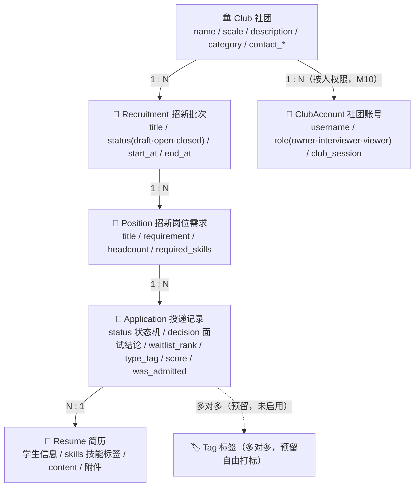
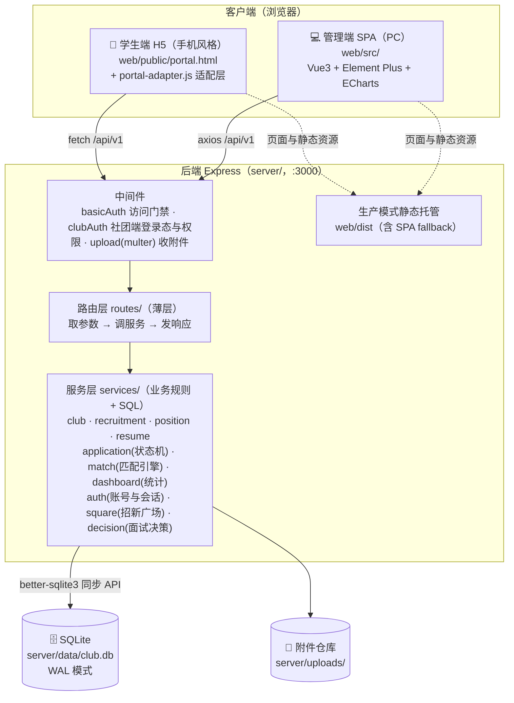
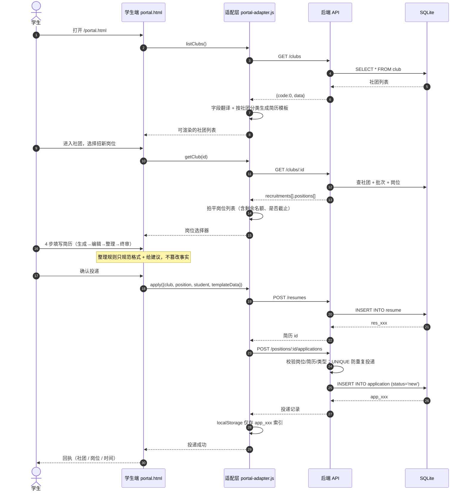
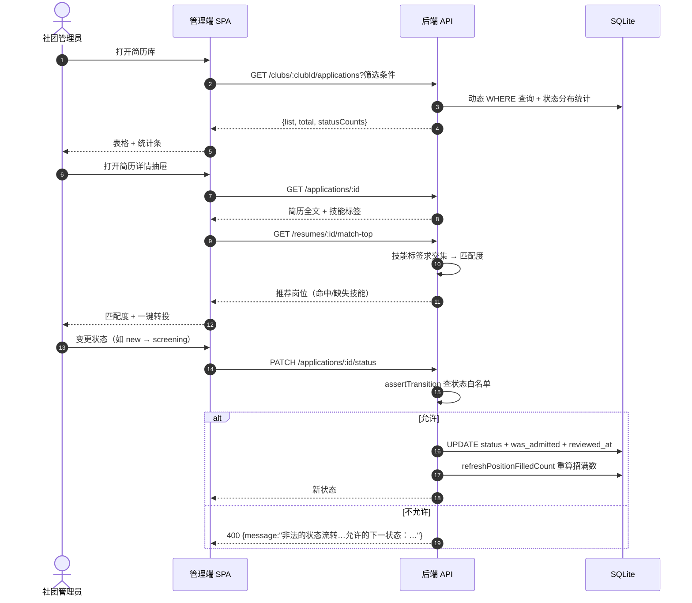
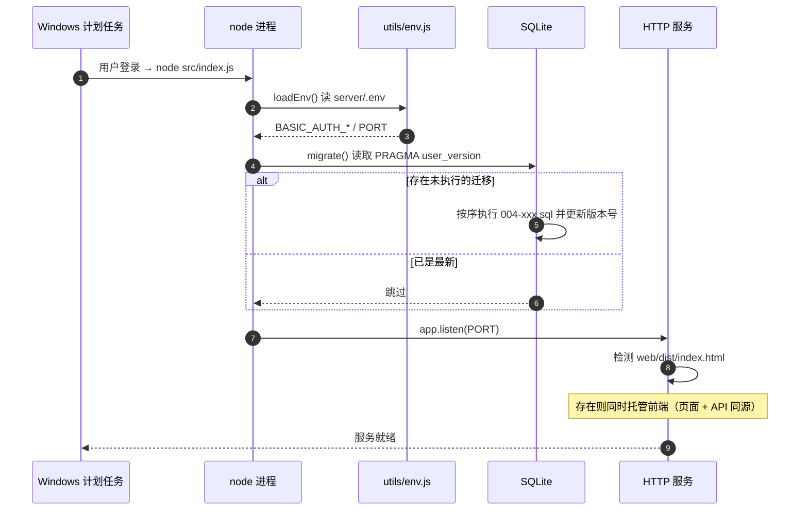
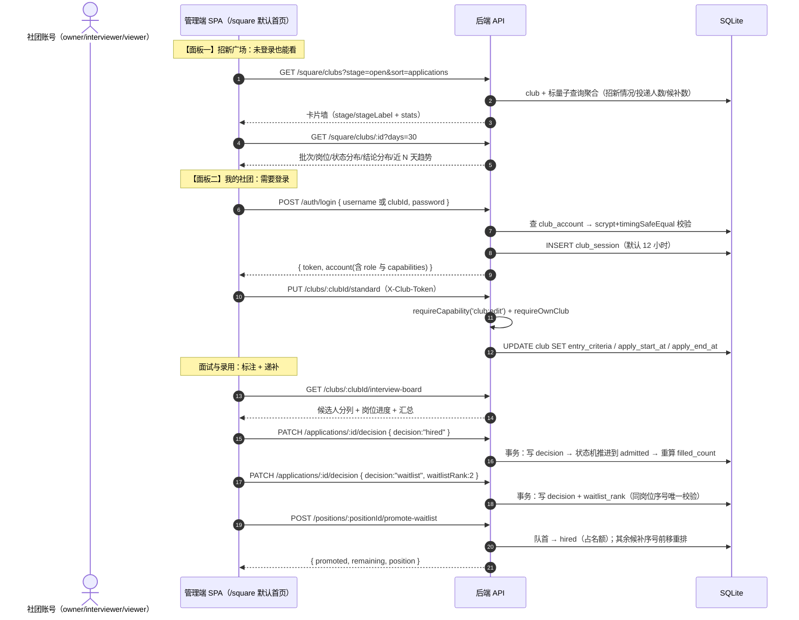

# 社团招新系统 · 架构设计

> 版本：v0.4　|　仓库：LLLDIOT/community　|　协议：MIT
> 更新记录：v0.1 基础系统（M0-M6）；v0.2 智能匹配 + 数据看板；v0.3 学生投递端整合；v0.4 社团端改造（招新广场 + 面试决策/候补递补 + 按人权限 + 登录）

## 1. 系统定位

面向高校社团的招新管理平台，**两端一后端**。核心解决四个问题：

1. **社团自我展示**：社团名称、规模、说明、招新需求、招新人数等信息的在线化维护。
2. **简历归档分类**：把学生投递的简历沉淀成"简历库"，支持**按招新需求分类**与**按简历类型分类**，便于筛选、流转与复盘。
3. **智能匹配**：简历技能标签 ↔ 岗位期望技能自动算匹配度，推荐岗位、发现误投。
4. **数据洞察**：招新漏斗、岗位进度、类型分布、投递趋势的可视化看板。

## 2. 角色与使用方式

| 角色 | 入口 | 能力范围 |
|---|---|---|
| 学生 | `/portal.html`（手机风格 H5） | 浏览社团、选择岗位、按模板填写简历、真实投递、查看投递进度 |
| 社团管理员 | `/`（管理端 SPA） | 维护社团资料、招新批次与岗位；简历库归档/筛选/状态流转/评分/导出；智能匹配；数据看板 |
| 访客 | 同管理端（当前开放模式） | 只读浏览，含招新广场（看得到各社团招新情况与投递人数，但改不了别人数据） |

## 2.1 社团账号角色（迁移 004：「每个人的权限」）

社团侧的账号不再是"全站一把密码"，而是**一个社团 → 多个账号**，每个账号带一个角色，
角色决定它能做什么（能力矩阵见 `authService.ROLE_CAPABILITIES`，经 `GET /dict` 下发前端）：

| 角色 | 中文 | 能做什么 |
|---|---|---|
| `owner` | 社长 / 管理员 | 全部：改社团资料与录入标准/投递时间、维护批次与岗位、看简历库、标面试结论、看板、**管理本社团账号** |
| `interviewer` | 面试官 | 看简历库与面试工作台、标注录用/候补/调剂/淘汰、看板；**不能改社团资料、不能管账号** |
| `viewer` | 观察员 | 只读：看简历库、面试工作台与看板；任何写操作被拒（403） |

入口：默认首页 `/square` 招新广场的右侧面板（未登录显示登录卡，登录后变成"我的社团"）。登录支持
"按社团登录"与"按账号登录"两种方式，token 存 localStorage，每次请求由 `api/client.js` 附加 `X-Club-Token`。

> **认证现状**：全站仍为"开放模式"（可选 HTTP Basic Auth 单密码保护，通过 `server/.env` 开关），
> 这是**访问门禁**；社团端另有一层**社团级账号 + 会话 token**（`club_account` / `club_session`），
> 回答"你是哪个社团的谁、能改哪条数据"。学生侧的身份验证（学号+短信）仍未实现，见第 8 节 M5。

## 3. 领域模型（概念层）



**按需求分类**：`Position` 天然形成树 `社团 → 批次 → 岗位 → 投递/简历`。
**按类型分类**：`Application.type_tag` 枚举（技术/组织/文艺/体育/学术/公益/其他）交叉筛选。
**智能匹配**：`Resume.skills` ↔ `Position.required_skills` 标签集合求交。
**面试决策**：`Application.decision`（录用/候补/调剂/淘汰）与 `status` 状态机**并行两层**，
候补另带 `waitlist_rank` 序号（同岗位唯一）以支持按序递补招满。
**按人权限**：`ClubAccount.role` → 能力矩阵决定"谁能改哪个社团的什么"，会话存 `club_session`（token）。

## 4. 系统架构



- 单仓库（monorepo-lite）：`server/` + `web/` 两个独立包，共享 `docs/` 与根 README。
- **单端口部署**：后端检测到 `web/dist` 存在即托管前端，页面 + API + 附件同源，无需 CORS。
- 开发期 `npm run dev` 由 Vite（:5173）代理 `/api` 与 `/uploads` 到 :3000。
- 学生端为**免构建的原生 HTML/JS**（放 `web/public/`，构建时原样复制到 `dist/`）。

## 5. 后端分层

```
server/src/
├─ index.js                    # 入口：loadEnv → migrate → listen
├─ app.js                      # Express 装配（json/basicAuth/静态/路由/托管/错误）
├─ db/
│  ├─ connection.js            # SQLite 单例（WAL、外键）+ 迁移器（user_version）
│  └─ ../db/migrations/        # 001-init / 002-add-was-admitted / 003-add-skill-tags / 004-club-console
├─ routes/                     # 10 个路由文件（薄层，3 行/路由）
│  clubRoutes / recruitmentRoutes / positionRoutes / resumeRoutes
│  applicationRoutes / matchRoutes / dashboardRoutes
│  authRoutes / squareRoutes / decisionRoutes
├─ services/                   # 业务核心
│  clubService(148) recruitmentService(100) positionService(82)
│  resumeService(72) applicationService(343, 状态机)
│  matchService(155, 匹配引擎) dashboardService(131, 统计聚合)
│  authService(328, 账号/会话/角色能力) squareService(269, 招新广场聚合)
│  decisionService(489, 面试决策/候补递补)
├─ middlewares/
│  ├─ basicAuth.js             # HTTP Basic Auth（可 env 开关）
│  ├─ clubAuth.js              # 社团端 token 解析 + requireCapability / requireOwnClub
│  └─ upload.js                # multer：白名单 + 10MB 限制
└─ utils/
   ├─ id.js                    # genId(前缀+随机) / nowIso
   ├─ respond.js               # ok() 统一响应 + parsePage 分页归一化
   ├─ errors.js                # BizError + notFound/badRequest/forbidden
   └─ env.js                   # 极简 .env 加载器（不依赖 dotenv）
```

**分层纪律**：routes 不写 SQL，services 不写 `res.send`，db 只被 service 引用。

## 6. API 约定

- Base URL：`/api/v1`
- 认证：两层——**HTTP Basic Auth**（可选，`BASIC_AUTH_DISABLE=1` 关闭；`/healthz` 免认证）是访问门禁；
  **社团端账号 token**（请求头 `X-Club-Token`，兼容 `Authorization: Bearer`）表达"哪个社团的谁"；招新广场只读无需登录
- 响应统一：成功 `{ code: 0, data }`；失败 `{ code, message }`（HTTP 状态码同时表达语义）
- 分页：`?page=1&pageSize=20` → `{ list, total, page, pageSize }`
- 字典：`GET /dict` 返回类型标签、状态文案、**状态流转白名单**、**面试结论枚举**、**角色能力矩阵**（前端复用后端规则）
- 学生端不新增后端接口，**复用** `/clubs`、`/clubs/:id`、`/resumes`、`/positions/:id/applications`、`/applications/:id`

详见 [API.md](API.md)。

## 7. 核心机制

| 机制 | 位置 | 说明 |
|---|---|---|
| 状态机 | `applicationService.STATUS_TRANSITIONS` | 白名单数据表 + `assertTransition` 校验；非法跳转返回允许的下一状态 |
| 招满计数 | `refreshPositionFilledCount` | `filled_count = COUNT(was_admitted=1)`，录取后归档也不丢计数 |
| 多维筛选 | `listClubApplications` | typeTag/status/grade/keyword/positionId/recruitmentId/decision 七个维度动态 WHERE + 状态优先级排序 + statusCounts/decisionCounts |
| 面试决策层 | `decisionService.setDecision` | `decision`（录用/候补/调剂/淘汰）与 `status` 状态机并行、互不覆盖；标注在**同一事务**内驱动状态流转 |
| 候补递补 | `decisionService.promoteWaitlist` | 候补序号同岗位唯一，队首提升为录用后其余序号自动前移（1 号永远最优先），实现"招满员"收口 |
| 按人权限 | `authService.ROLE_CAPABILITIES` + `clubAuth` | 角色→能力矩阵是唯一事实来源，中间件按"登录(401)→能力(403)→本社团(403)"顺序把关，前端用同一份矩阵隐藏按钮 |
| 招新广场聚合 | `squareService.listSquareClubs` / `getSquareClub` | 一组标量子查询（避免 N+1）聚合各社团招新情况与投递人数；阶段由批次状态 + 时间窗推导；趋势补 0 值 |
| 技能匹配 | `matchService.matchSkills` | 归一化标签 → 命中率百分比 + 命中/缺失明细 |
| 转岗建议 | `matchService.matchClubApplicants` | 未录取投递者 × open 岗位，≥50% 建议改投（已批量取 existingPairs 防 N+1） |
| 看板聚合 | `dashboardService.getDashboard` | 8 条只读 SQL → core/funnel/progress/distributions/trend（趋势补 0 值） |
| 访问保护 | `middlewares/basicAuth.js` | 常量时间比较；未配置强密码时启动告警 |
| 数据持久化 | SQLite WAL | 投递真实落库；学生端 localStorage 仅存档案与投递 id 索引 |

## 7.1 核心时序图

### 学生投递（学生端 → 数据库落库）



### 投递后的状态流转（管理端）



### 高并发无关但重要的启动时序



## 8. 里程碑

| 里程碑 | 内容 | 状态 |
|---|---|---|
| M0 | 仓库初始化 + docs | ✅ |
| M1 | 数据模型 + 社团/批次/岗位 CRUD API | ✅ |
| M2 | 简历上传 + 投递 + 状态机 API | ✅ |
| M3 | 前端框架 + 社团资料与招新管理页 | ✅ |
| M4 | 前端简历库：列表/详情/筛选/归档 | ✅ |
| M5 | 认证与角色权限（多角色 JWT / 学号验证） | ⏸ 暂缓（当前为开放模式 + 可选 Basic Auth） |
| M6 | 导出 / Docker / 部署文档 | ✅ |
| M7 | 智能匹配（技能标签 + match API + 推荐 UI） | ✅ |
| M8 | 数据看板（指标/漏斗/进度/分布/趋势 + 导航分区） | ✅ |
| M9 | 学生投递端整合（H5 + 适配层，真实落库） | ✅ |
| M10 | 社团端改造（招新广场双面板 + 面试决策/候补递补 + 按人权限 + 登录） | ✅ |

> **M5 说明**：需要时补 user 表 + JWT 登录 + `club_admin` 与 club 绑定 + 路由守卫
> （预留位置：`recruitmentService.assertClubAccess` 的 TODO；学生端可加学号+短信验证）。
> **M10 补充**：社团侧的"账号与社团绑定 + 按人权限"已由 `club_account` / `club_session`
> 与会话 token 落地（对应 M5 中 `club_admin` 与社团绑定这一项，用随机 token 而非 JWT）；
> 学生侧的身份验证仍待办。

## 8.1 社团端改造（M10）数据流



## 9. 环境与工具链

- Node.js ≥ 20（开发机 v24.18.0）
- npm 11、Vite 6、Vue 3.5、Element Plus 2.9、ECharts 5
- Express 4 + better-sqlite3 13 + multer 2
- SQLite 3（内嵌，无独立数据库服务）
- Git 2.55（受限网络下经 SOCKS5 代理访问 GitHub）

## 10. 关键设计决策记录（ADR 摘要）

| 决策 | 选择 | 理由 |
|---|---|---|
| DB | SQLite（better-sqlite3） | 零配置、单文件备份、同步 API 让代码是顺序流 |
| 后端 | Express 薄路由 + service 层 | 简单可控，不引入过重框架 |
| 管理端 | Vue3 + Element Plus + ECharts | 中后台组件全、中文生态好、图表开箱即用 |
| 学生端 | 原生 HTML + **适配层**而非重写 | 复用后端接口零改动，代码量约重写方案的 1/12 |
| 学生端模板 | 按社团分类动态生成（不建模板表） | 免迁移即得差异化模板；需自定义时再补表 |
| 简历文件 | multer 本地磁盘 | 避免对象存储账号成本，投产可换 S3/OSS |
| 状态流转 | 显式白名单数据 | 后端校验 + 前端复用同一份规则，杜绝非法跳转 |
| 招满计数 | 冗余 `filled_count` + 单入口刷新 | 列表页零成本读招满情况；写入收敛到一处保证一致 |
| 归档语义 | `was_admitted` 终身标记 | 修"录取后归档导致招满数归零"的缺陷 |
| 面试结论 | `decision` 与 `status` **分成两层**，不往 status 里加状态 | status 表示"流程走到哪一步"，decision 表示"面试结论"。候补 1 号是不改变流程、只决定录用顺序的结论，塞进 status 会让状态机多出非终点状态并污染 `filled_count`（`was_admitted=1`）口径；分层后 004 只新增列，001~003 的状态机与统计口径零改动 |
| 登录态传递 | 自定义头 `X-Club-Token`（兼容 `Authorization: Bearer`），不用 `Authorization` | 全站还有一层 HTTP Basic Auth 也用 `Authorization`；前端 JS 显式设置 Bearer 会覆盖浏览器自动附加的 Basic 凭据，重新开启 Basic Auth 后所有请求都会 401。独立头让两个机制彻底不打架，Bearer 回落只为 curl/脚本方便 |
| 候补与递补 | 候补序号**同岗位唯一**，递补时其余序号**自动前移** | 唯一性防止出现两个"候补 1 号"这种无法裁决的状态；递补后立即重排，保证"序号 = 优先级"这一不变式始终成立，招满员只需反复取队首 |
| 简历"优化" | 只规范格式 + 给建议，**不篡改事实** | 原型的"多名→15名"式改写属伪造经历，必须禁止 |
| 部署 | Docker 多阶段 + Windows 计划任务 | 前者标准可移植，后者本机登录自启 |
