# 社团招新系统 · 新手完全指南

> 面向第一次接触本项目的同学：从"这是个什么东西"讲到"数据怎么流动""部署在哪台机器上"。
> 阅读顺序建议：第 1 节 → 第 2 节（结构图）→ 第 3 节（时序图）→ 第 4 节（数据流）→ **4.5（面试决策与候补递补）/ 4.6（按人权限）** → 第 5 节（部署）。
> 想直接上手操作的话，跳到最后的**第 6 节「新手速查表」**。

---

## 1. 先用生活比喻认识它

把整个系统想象成一个**招新市场**：

| 系统里的东西 | 现实中的对应物 | 一句话解释 |
|---|---|---|
| **学生端**（`portal.html`） | 市场里学生手里的**手机** | 学生用它看社团、填表、交表 |
| **管理端**（Vue 页面） | 社团办公室里的**电脑** | 管理员用它看谁交了表、决定录不录 |
| **招新广场**（`/square`） | 市场门口的**公告栏** + 你自己的**摊位** | 左边公告栏谁都能看（谁家在招人、多少人投）；右边摊位得用钥匙才能开 |
| **账号与角色**（社长/面试官/观察员） | **总钥匙 / 帮工袖标 / 访客胸牌** | 总钥匙能开所有抽屉；帮工能面试打分但不能改招牌；访客只能看不能动 |
| **后端 API**（Express） | 中间的**服务台/邮局** | 两边都不直接对话，所有事都交给它办 |
| **数据库**（SQLite） | 服务台后面的**档案柜** | 表格交上来就锁进柜子，永不丢失 |
| **前端/后端** | 门面 / 后厨 | 前端=你看到和点的界面；后端=真正干活和记账的地方 |

**为什么要分"前端/后端"？**
因为界面会变（换手机、换电脑、换成小程序），但"谁被录取了""社团招了几个人"这些规则和数据不能乱。分开之后，改界面不影响数据规则，改规则也不用重画界面。

---

## 2. 结构图（系统长什么样）

结构图回答的问题是：**这个系统由哪几块拼成，谁跟谁说话。**

### 2.1 整体结构图

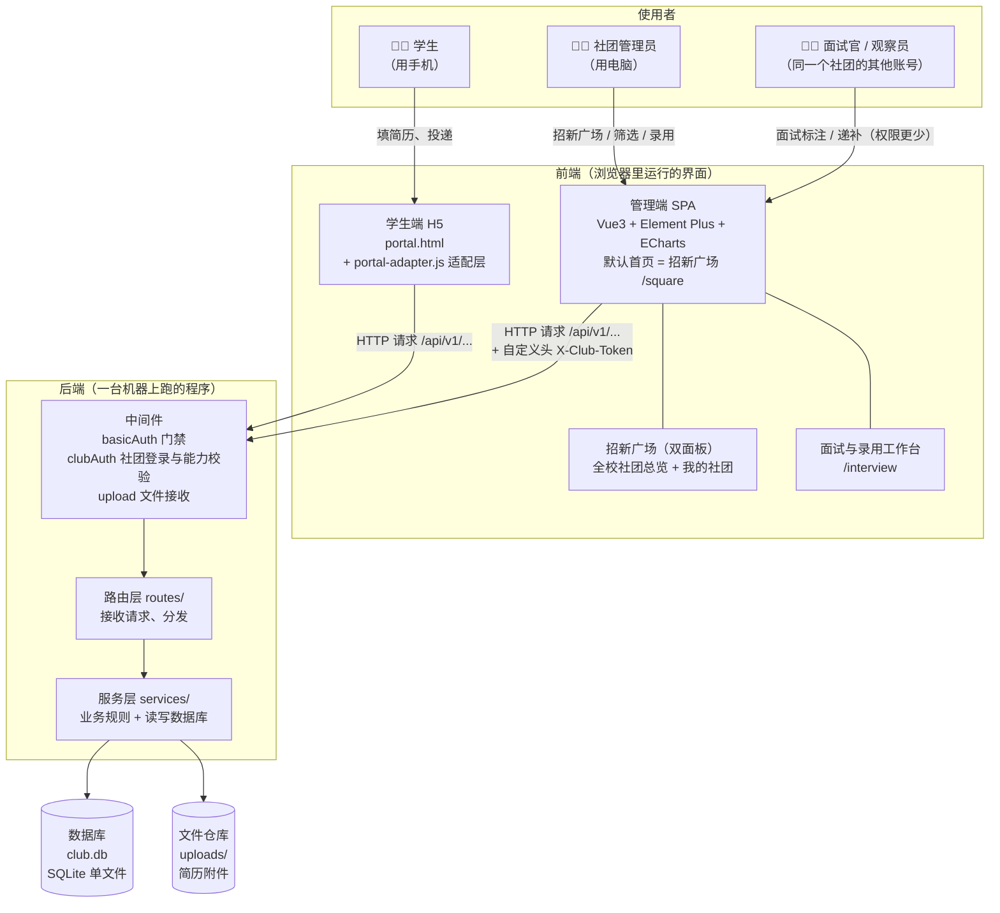

**看图要点（新手最容易搞混的）**：
- 学生端和管理端**从不直接读写数据库**。它们只会"喊话"（发 HTTP 请求），由后端决定给不给、怎么给。
- 中间件像**门卫**：`basicAuth` 检查你有没有密码，`upload` 负责接收上传的文件，`clubAuth` 负责认"你是哪个社团的哪个人"。
- **一个社团可以有好几个账号**（社长/面试官/观察员），他们看到的是同一个界面，但能点的按钮不一样——详见 4.6 节。
- 数据库只有一个文件（`club.db`），拷走它=备份了全部业务数据。

### 2.2 后端分层结构图

后端内部按"责任"分成三层，每层只干自己的事：

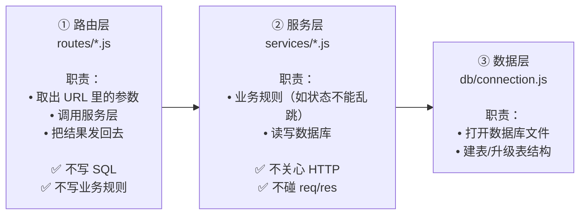

**为什么这样分？（新手必读）**
假设以后要做手机 App，只需要重写"路由层"（换成 App 能听懂的格式），服务层的规则和数据库完全不用动。
反过来，如果"招新人数不能少于已录取数"这条规则要改，只改服务层一处，前端、App、后台脚本全都自动生效。

### 2.3 前端结构图

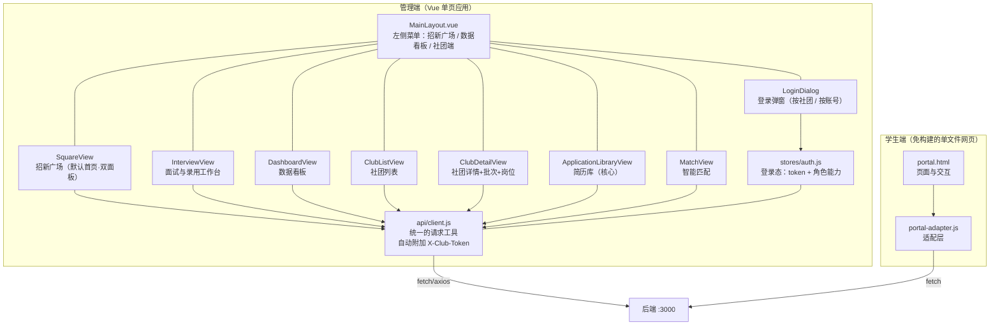

**「招新广场」的双面板长什么样？**

```
┌────────────────────────── 🏛️ 招新广场 ──────────────────────────┐
│  所有社团  招新中  开放名额  累计投递          ← 顶部概览         │
├───────────────────────────────┬─────────────────────────────────┤
│ 面板一：全校社团总览（谁都能看）│ 面板二：我的社团（要登录）      │
│  [搜索] [类型] [阶段] [排序]   │  未登录 → 登录卡                │
│  ┌────────┐ ┌────────┐        │  已登录 → 本社团实况统计        │
│  │🖥️ 计算机│ │🎵 音乐社│  …    │        · 信息录入标准（可编辑） │
│  │招新中   │ │已截止  │        │        · 投递时间（可编辑）     │
│  │投递 12 │ │投递 3  │        │        · 岗位招满进度           │
│  │已录 2/5│ │已录 5/5│        │        · 账号与权限             │
│  └────────┘ └────────┘        │                                 │
│  点任意卡片 → 看它的招新情况详情│                                 │
└───────────────────────────────┴─────────────────────────────────┘
```

左面板是"**逛市场**"：你可以点进**任何**社团，看它招什么岗、有多少人投、录满了没有。
右面板是"**回自己摊位**"：只有登录了**本社团**的账号，才能改这里的标准和时间。

**「面试与录用工作台」（`/interview`）长什么样？**

```
┌──────────────── 面试与录用工作台 ────────────────┐
│ 候选总数 20 │ 已录用 6 │ 候补中 3 │ 已调剂 2 │ 还缺 2 │  ← 汇总条
├──────────────────────────────────────────────────┤
│ 岗位招满进度：前端干事 6/8 ▓▓▓▓▓▓░░ 候补 3 人 [递补]│
├──────────────────────────────────────────────────┤
│ 筛选：[批次] [岗位] [关键词] ☐只看未决定          │
├────────┬────────┬────────┬────────┬─────────────┤
│ 新收到 │ 待筛选 │ 面试中 │ 已录取 │ 已淘汰/归档  │
│ ┌────┐ │ ┌────┐ │ ┌────┐ │ ┌────┐ │ ┌────┐      │
│ │张三│ │ │李四│ │ │王五│ │ │赵六│ │ │钱七│      │
│ │匹配│ │ │匹配│ │ │匹配│ │ │录用│ │ │淘汰│      │
│ │90% │ │ │75% │ │ │60% │ │ │✓   │ │ │✕   │      │
│ │[录用][候补][调剂][淘汰]│  ← 卡片上直接标注        │
│ └────┘ │ └────┘ │ └────┘ │ └────┘ │ └────┘      │
└────────┴────────┴────────┴────────┴─────────────┘
```

一句话：**左边一列列往下走 = 流程（status），卡片上的小标签 = 面试结论（decision）**，两者互不覆盖，但配合起来就能"招满员"。为什么这样设计，见 4.5 节。

**"适配层"是什么？**
学生端原本是一个独立做的原型，它期望的数据格式（字段名）和后端给的不一样。
适配层就是**翻译官**：后端说 `description`，适配层翻译成原型认识的 `intro`；后端说 `positions[].title`，翻译成 `name`。
好处是：**后端一行都不用改**，学生端就能用真实数据。

---

## 3. 时序图（事情是按什么顺序发生的）

时序图回答的问题是：**从头到尾，谁先动、谁后动、传了什么。**

### 3.1 学生投递简历（最核心的流程）

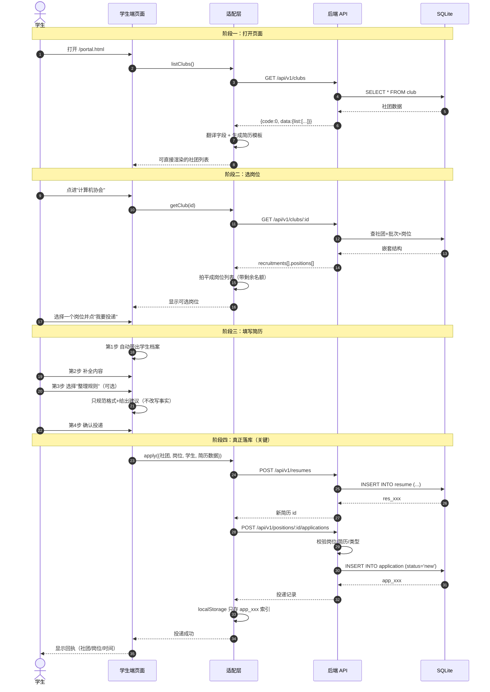

**新手重点理解**：
- "投递成功"这句话之所以可信，是因为它前面真的执行了两次数据库写入（简历 + 投递）。
- 浏览器只存了一个编号（`app_xxx`），内容全在服务器上——所以**换浏览器只是看不到历史列表，数据本身不会丢**。

### 3.2 管理员处理简历

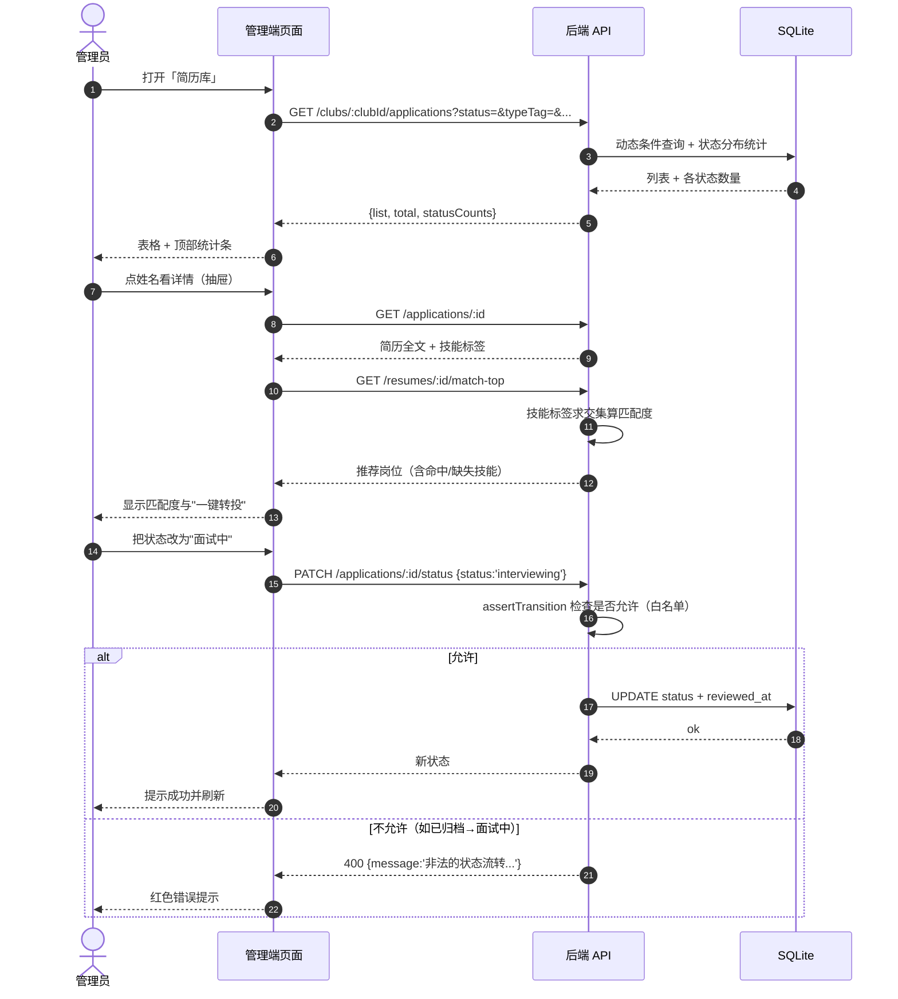

### 3.3 系统启动（后端开机自启时发生什么）

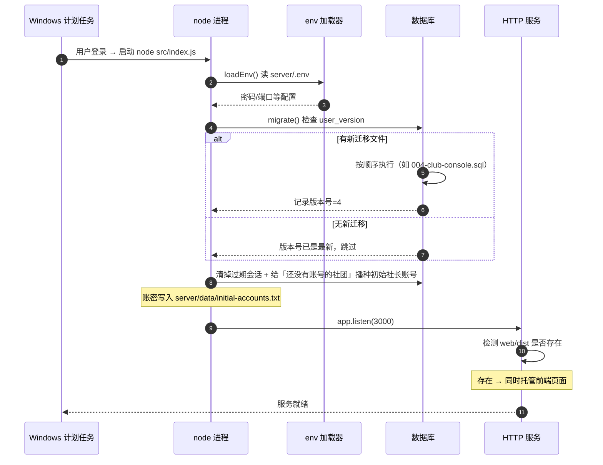

---

## 4. 数据流详解（数据从哪来、到哪去、变成什么）

### 4.1 三种数据，去三个地方

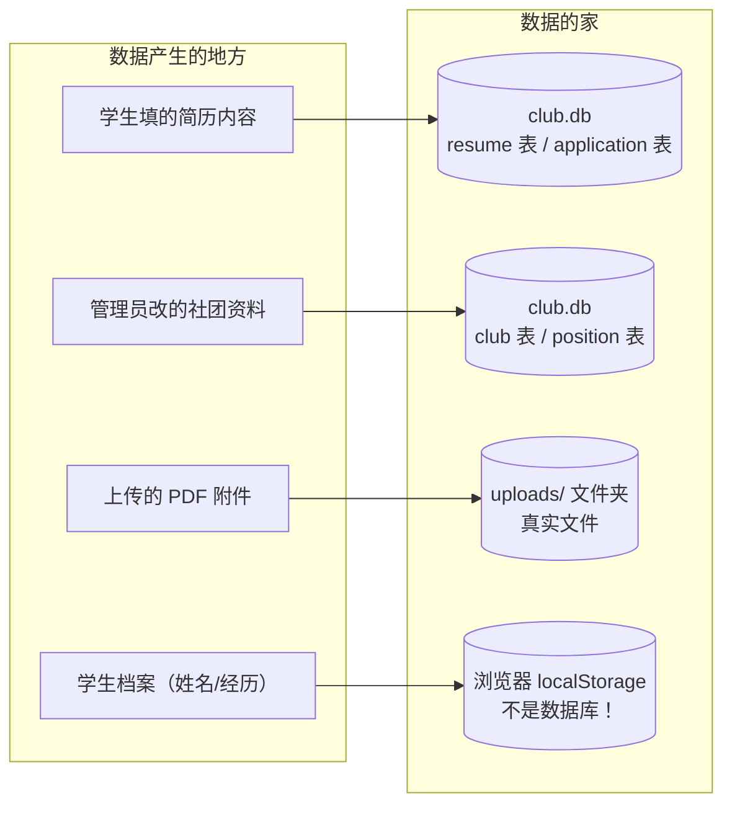

**为什么要区分 localStorage 和数据库？**
- **数据库**：所有"业务数据"（谁投了哪个岗位、社团招了几个人）——永久保存、多人共享、重启不丢。
- **localStorage**：只是**这台电脑这个浏览器**里的小本子，用来记住"我叫什么、我投过哪几份"。
  换个浏览器就空了，但服务端的数据一条都不会少。

### 4.2 一次投递，数据"变形记"

这是新手最该理解的一段：**同一份信息，在流动过程中换了三次样子。**

```
【第 1 次变形】学生在手机页面上填的（一堆输入框）
  姓名: 张三
  技术技能: Vue, Node.js
  代表项目作品描述: 二手交易平台，Vue3+Express...

        ↓ 适配层 apply() 把它拼成一段文本

【第 2 次变形】简历正文（content 字段，人可读的字符串）
  【姓名】
  张三

  【基本信息（学院/专业/年级）】
  计算机学院 · 软件工程 · 大二

  【技术技能】
  Vue, Node.js

  【代表项目作品描述】
  二手交易平台，Vue3+Express...

        ↓ POST /resumes → 后端 INSERT

【第 3 次变形】数据库里的一行（结构化字段）
  resume 表:
    id            = res_a1b2c3
    student_name  = 张三          ← 单独存，方便按姓名搜索
    skills        = Vue, Node.js  ← 单独存，用于智能匹配
    content       = "【姓名】\n张三\n\n…"  ← 整段存，用于展示
    major         = 软件工程
    grade         = 大二
  application 表:
    id            = app_x9y8z7
    position_id   = pos_前端开发干事
    resume_id     = res_a1b2c3
    status        = new           ← 新收到，等待社团处理
    type_tag      = technical     ← 从社团分类自动映射而来

        ↓ 管理端 GET /clubs/:id/applications

【第 4 次变形】管理端表格里的一行（多表拼出来的）
  张三 | 大二 | 软件工程 | 2026秋季招新·前端开发干事 | 技术型 | 新收到 | ☆☆☆☆☆
```

**新手注意**：为什么"技能"要单独存一列，而不是只留整段文本？
因为智能匹配需要**精确比对标签**（`Vue` vs `vue`），从一整段文字里猜技能不可靠。
这体现了数据库设计的一个原则：**要用来筛选/计算的字段，就单独给它一列。**

### 4.3 一条简历的完整生命周期

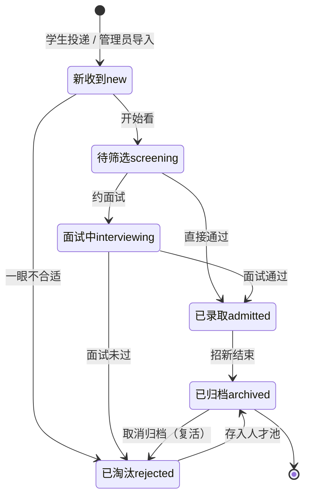

**两条重要规则**：
1. **不能跳步**：`新收到` 不能直接变 `已录取`（必须先经过筛选/面试），后端会拒绝并告诉你允许的下一步。
2. **归档不等于删除**：归档只是"这件事处理完了"，数据还在，随时能取消归档。

> 💡 **还有一层别忘了**：上面这张状态机图只回答"流程走到哪一步"。
> 真正决定"录不录、录不上排第几"的是**面试结论（decision）**这一层，它和状态机**并行存在、互不覆盖**。
> 这正是"候补 1 号"能存在的原因——详见 4.5 节。

### 4.4 数据存在哪：一张地图

```
D:\GitHub库\社团\
├─ server\
│  ├─ data\
│  │  ├─ club.db          ← ★ 所有业务数据（社团/岗位/简历/投递/社团账号）
│  │  ├─ club.db-wal      ← 数据库的"正在写入"暂存区（WAL 模式）
│  │  ├─ club.db-shm      ← 数据库的索引共享内存
│  │  └─ initial-accounts.txt ← 首次启动自动生成的社团社长账密（只在本机，已 gitignore）
│  ├─ uploads\            ← 简历附件实体文件（PDF/图片）
│  └─ .env                ← 访问密码（不提交到 Git）
└─ web\
   └─ dist\               ← 前端构建产物（后端会自动托管它）
```

**备份方法（新手版）**：
```powershell
# 停服务 → 复制这两个地方 → 完成
Copy-Item "D:\GitHub库\社团\server\data" "$env:USERPROFILE\backup\data" -Recurse
Copy-Item "D:\GitHub库\社团\server\uploads" "$env:USERPROFILE\backup\uploads" -Recurse
```
（`club.db-wal` 里可能存着还没并入主库的最新写入，所以整个 `data` 文件夹一起拷。）

### 4.5 面试决策与候补递补（"候补 1 号"到底是什么）

#### 先用生活比喻：招 2 个人，来了 5 个人

你是社团负责人，这个岗位要招 **2** 个人，面试了 5 个都不错。
纸质年代你会怎么做？你会写一张纸：

```
正式录取：张三、李四
候  补：1. 王五   2. 赵六
```

"候补"的意思不是"没通过"，而是"**你先在门口排队，前面有人不来了就按顺序叫你进来**"。
这张纸有两个关键特点：

1. **候补是"结论"，不是"流程"**：王五的流程已经走完了（面试完了），他只是**结论**是"排队中"。
2. **候补有顺序**：一定要写"1 号、2 号"，否则有人放弃时你不知道该叫谁。

系统里的做法，和这张纸一模一样。

#### 系统里的四种结论 + 一种"没结论"

| 结论（decision） | 通俗解释 | 会推进流程状态吗？ | 会占名额吗？ |
|---|---|---|---|
| `''` 未定 | 还没面试／还没决定 | — | 不占 |
| `hired` 录用 | 要了 | ✅ 推进到"已录取" | ✅ 占 1 个 |
| `waitlist` 候补（带序号 1、2…） | 排队等叫号 | ❌ **原地不动** | ❌ **一个都不占** |
| `adjust` 调剂 | 我这满了，但同社团别的岗位缺人，转过去 | ✅ 在目标岗位新开一条投递 | 算在目标岗位上 |
| `reject` 淘汰 | 不合适 | ✅ 推进到"已淘汰" | 不占 |

#### 为什么"候补 1 号"不是一条状态？

这是在学这个系统时最值得想明白的一处设计。

状态机（4.3 节那张图）是**一条线**：一条投递在某一刻只能站在一个点上——"新收到"或者"面试中"或者"已录取"。
如果硬把"候补"塞进这条线里，立刻会冒出一堆答不上来的问题：

- 排在"候补"之后，还能不能变回"面试中"？还能不能变成"已录取"？→ 状态机要重画。
- "候补"算不算已经招到人了？`filled_count`（已录人数）要不要 +1？→ 招新进度统计口径会被搅乱（候补 5 个人，难道显示超额完成？）。
- 招新结束时"候补"算不算归档？→ 又一条分支。

所以系统把两件事**拆成两层**，各管各的：

```
 ┌─────────────────── 流程层 status ───────────────────┐
 │  新收到 → 待筛选 → 面试中 → 已录取 / 已淘汰 → 已归档  │  ← 只回答「走到哪一步」
 └─────────────────────────────────────────────────────┘
                          ✕ 互不覆盖（并行两层）
 ┌─────────────────── 结论层 decision ─────────────────┐
 │  未定 / 录用 / 候补1号 / 候补2号 / 调剂 / 淘汰        │  ← 只回答「面试结果是什么」
 └─────────────────────────────────────────────────────┘
```

好处非常实际：**标"候补 1 号"时，流程状态原地不动、名额一个不占**；
等到真要他时（有人放弃），再一次性把他提升为"录用"——那一刻才推进状态机、才占名额。
候补的人也不会污染看板和漏斗统计。

> 🔒 **一条防呆规则**：同一个岗位里，候补序号不能重复。
> 你想把两个人同时标成"候补 1 号"时，后端会返回 400 并拒绝——因为两个 1 号就没法判断该先叫谁。

#### 一张图看懂：从投递到招满

```
                       ┌──────────────┐
   学生投递 ──────────► │  new 新收到   │
                       └──────┬───────┘
                              │ 开始看 / 约面试
                       ┌──────▼────────┐
                       │screening 待筛选│
                       └──────┬────────┘
                ┌─────────────┼──────────────┬────────────────┐
                │             │              │                │
        ┌───────▼──────┐ ┌────▼───────┐ ┌────▼───────┐ ┌──────▼──────┐
        │  录用 hired   │ │候补1号      │ │候补2号      │ │ 淘汰 reject │
        │→ 流程=已录取   │ │waitlist=1  │ │waitlist=2  │ │→ 流程=已淘汰 │
        │  占名额 1 个   │ │不占名额     │ │不占名额     │ │             │
        └───────┬──────┘ └────┬───────┘ └────┬───────┘ └─────────────┘
                │             │              │
                │             └── 等着被"递补"叫号 ──┘
                │
   ┌────────────▼──────────────────────────────────────────────────┐
   │ 以上任意一步都可以改标成「调剂 adjust」：                      │
   │ 本岗位满了、但他的技能适合同社团的别的岗位                    │
   │   → 原投递记一条"调剂→目标岗位"，并在目标岗位新开一条投递      │
   └───────────────────────────────────────────────────────────────┘
```

**一句话记忆**：**录用=占名额，候补=排队不占名额，调剂=换岗位，淘汰=出局**。

#### 递补：有人放弃时，怎么"招满员"

这是整套机制真正发挥作用的地方。看一遍下面的过程就懂了：

```
【递补前】岗位需求 2 人，当前已录 2 人 → 招满 ✅
   已录用：张三(录用)   李四(录用)              → 2/2
   候补队列：候补 1 号 = 王五    候补 2 号 = 赵六

        ↓ 李四放弃了。社团把他的结论点「撤销」（或改标为「淘汰」）

【变化】名额空出 1 个，但候补队列还是那两个人
   已录用：张三                                → 1/2（还缺 1）
   候补队列：候补 1 号 = 王五    候补 2 号 = 赵六   ← 队列没动

        ↓ 点一次「递补」按钮（工作台的岗位进度卡上，或候补队列弹窗里）

【递补动作】系统只提升「队首」= 候补 1 号，并把他真正变成录用
   · 王五：结论 waitlist → hired，流程推进到「已录取」，名额 +1
   · 其余候补序号自动前移：赵六从「候补 2 号」变成「候补 1 号」

【递补后】又招满了 ✅
   已录用：张三、王五(由候补 1 号递补上来)      → 2/2
   候补队列：候补 1 号 = 赵六                   ← 1 号永远是最优先的那个
```

**三条必须记住的规则**：

1. **只叫队首**：递补永远提升"候补 1 号"（也可以指定某个人，但默认就是队首），剩下的人序号自动前移。
2. **队空了会被拒绝**：候补队列为空时点递补，后端返回 400——不会凭空造出一个录用者。
3. **撤销是可逆的**：如果一个人本来是"已录用"，你把结论撤销成"未定"，他的流程状态会退回"面试中"，岗位已录人数也会正确减回去（不会出现"少了一个人但名额没还回来"的错账）。

#### 调剂和"候补"有什么区别？

新手很容易混：两者都是"这个岗位没进去"，但含义完全不同。

| | 候补 | 调剂 |
|---|---|---|
| 想不想招他 | **想**，只是暂时没名额 | 本岗位不合适／满员，但别的岗位合适 |
| 结果 | 留在原岗位排队等叫号 | **换到同社团的另一个岗位**，重新走流程 |
| 名额 | 不占 | 算在**目标岗位**上 |
| 系统动作 | 只写结论 + 序号 | 原投递记一条"调剂→目标岗位"，目标岗位**新建一条投递** |

系统还能帮你推荐调剂目标：调剂的弹窗里会按**技能匹配度**列出同社团其他岗位、命中哪些技能、还剩几个名额，点一下确认即可。
规则上：**只能调剂到同一个社团的其他岗位**（不能调到别的社团，也不能调剂到当前岗位）；如果这个人已经投过目标岗位，系统会识别出来并提示"已投过"，不会重复建单。

### 4.6 按人权限：一个社团可以有很多账号

#### 再打个比喻：社团办公室的钥匙

以前社团端只有"一个密码"，谁拿到谁就是全能管理员——像把**办公室总钥匙**复印给了所有人。
现实里不会这样：

| 角色 | 现实对应 | 能做什么 |
|---|---|---|
| **社长 / 管理员**（`owner`） | 拿着总钥匙的人 | 什么都能干：改社团资料、建批次岗位、**改录入标准与投递时间**、面试决策、**加人删人改密码** |
| **面试官**（`interviewer`） | 面试当天来帮忙的学长学姐 | 能看简历、**能标注录用/候补/调剂/淘汰**；但改不了社团资料，也加不了账号 |
| **观察员**（`viewer`） | 来旁听学习的同学 | **只能看**（简历库、工作台、看板），一个字都改不了 |

一个社团可以同时有多个账号：社长 1 个 + 面试官若干 + 观察员若干。谁的账号做了操作，系统都记得（决策上会记录标注人）。

> 🔒 **两条防呆规则**（新手改账号时会遇到）：
> - 系统保证每个社团**至少留一个可用的社长账号**：你不能把最后一个社长停用、降级或删除，否则会被拒绝——这是为了"别把钥匙全丢了，把自己锁在门外"。
> - **不能删除自己正在使用的账号**；新密码**至少 6 位**。

#### "能力"（capability）是怎么表示的

系统不写"如果是社长就允许"，而是先把角色翻译成一串**能力名**，再判断"你有没有这个能力"：

```
owner        → club:edit、recruitment:edit、position:edit、application:read、
               application:decide、dashboard:read、account:manage
interviewer  → application:read、application:decide、dashboard:read
viewer       → application:read、dashboard:read
```

这张对照表（角色 → 能力）只写在**后端一个地方**，并通过 `GET /api/v1/dict` 下发给前端。
好处：以后要新增一种角色（比如"财务"），只改这张表，所有接口的鉴权自动跟着变。

#### 为什么"前端隐藏按钮"之后，"后端还要再拦一道"

这是新手最该建立的安全直觉：

> **前端代码是跑在用户浏览器里的，用户想看什么、改什么，你管不住。**

懂一点技术的人按 F12 就能改页面上的 JS，把灰色的按钮改成可点的。
所以：

- **前端隐藏按钮** = 体贴。目的是"别让人点了半天才收到报错"，让界面符合角色身份。
- **后端拦截** = 真正的门锁。每个接口进来时依次检查三件事：
  1. 你带 token 了吗？（没带 → 401）
  2. 你的角色有这项能力吗？（没有 → 403，比如观察员想点"录用"）
  3. 你操作的这条数据，是你自己社团的吗？（不是 → 403，比如 A 社团想改 B 社团的标准）

冒烟测试里专门有一组用例在验证这道门锁：**观察员发起决策被拒（403）、观察员改录入标准被拒（403）、别的社团账号改我的标准被拒（403）**，同时观察员**仍然能正常只读**工作台（200）。这就是"隐藏按钮 + 后端拦截"的分工。

#### 登录之后，系统怎么记住"你是谁"

这里有两个必须认识的词：**Token** 和 **会话（Session）**。

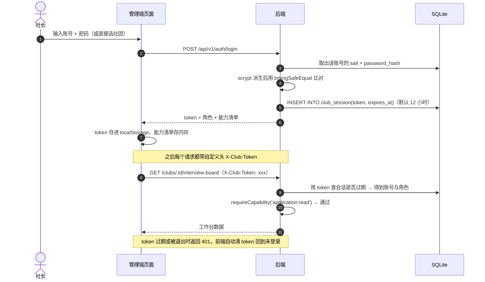

- **Token**：一串随机字符，相当于"**今天有效的临时工牌**"。服务端按 token 认出你是谁。
- **会话（Session）**：服务端数据库里的一条记录（`club_session` 表：token、账号、创建时间、过期时间）。
  默认 **12 小时**过期，可用环境变量 `CLUB_SESSION_HOURS` 改。过期/退出后这条记录被删掉，工牌立刻作废。
- 为什么请求头叫 **`X-Club-Token`** 而不是常见的 `Authorization`？因为全站外面还套了一层访问密码（Basic Auth），那一层也在用 `Authorization`，两个混在一起会打架。所以社团登录态走自己的专用头。
- **密码怎么存的**：不存明文。每个账号有自己的**随机盐**，密码用 **scrypt** 派生后只存结果；比对时用 `timingSafeEqual`（比较耗时和内容无关），避免"根据响应快慢猜密码"的时序攻击。
- **初始账号从哪来**：首次启动时，系统会给**还没有任何账号的社团**自动建一个社长账号，账密写在 `server/data/initial-accounts.txt`（该目录已 gitignore，不进仓库）。登录后就能在「我的社团 → 账号与权限」里新建面试官/观察员、改角色、停用账号、重置密码，也能改自己的密码（**改完会强制下线，需要重新登录**）。

---

## 5. 部署拓扑（程序跑在哪、怎么连起来）

### 5.1 当前的实际部署（本机 Windows）

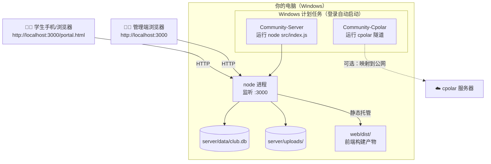

**新手理解要点**：
- **只有一个进程在对外服务**（node，监听 3000）。前端页面不是"另一个服务器"，而是被这个 node 顺手一起发出去的。
- 所以只要 3000 活着，管理端、学生端、API、附件全都能访问。
- 计划任务的作用：让你**不用每次开机手动敲命令**。

### 5.2 两种运行模式的区别

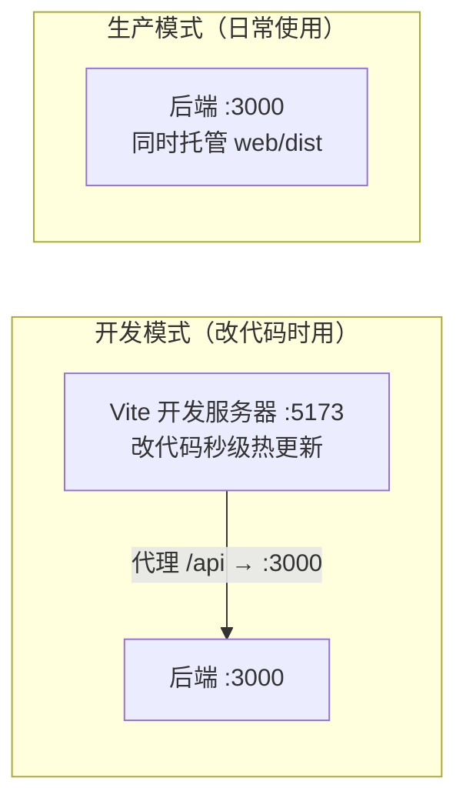

| | 开发模式 | 生产模式 |
|---|---|---|
| 启动命令 | 两个终端：`cd server && npm run dev`、`cd web && npm run dev` | `node src/index.js`（或计划任务） |
| 访问地址 | `http://localhost:5173` | `http://localhost:3000` |
| 改代码后 | 浏览器自动刷新 | 需要 `npm run build` 重新构建前端 |
| 用途 | 写代码、调界面 | 给真实用户用 |

**新手最常见的坑**：改了 Vue 代码，但访问的是 `:3000` → 看不到变化。因为 3000 用的是**上次构建的旧产物**，必须先 `npm run build`。

### 5.3 Docker 部署（换台机器时用）

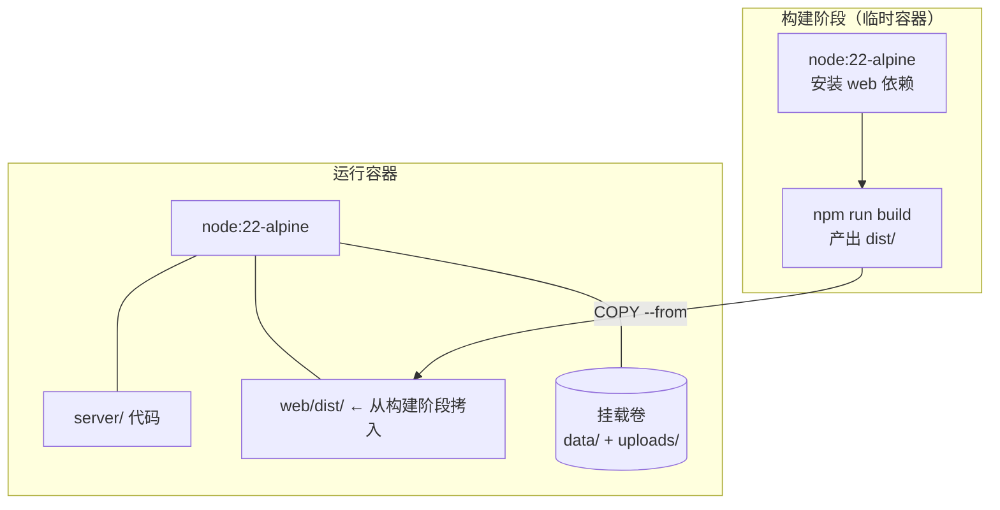

一条命令启动：`docker compose up -d --build` → 访问 `http://服务器IP:3000`。
**为什么数据要挂载卷**：容器删了重建，卷里的数据还在（否则每次更新都清空简历库）。

### 5.4 公网访问（可选，cpolar 隧道）

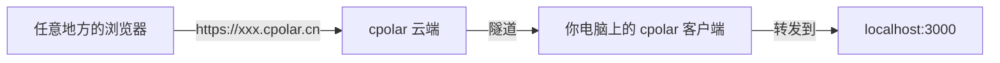

**两个新手必须知道的限制**：
1. 免费版域名是**随机**的，重启隧道会变（要固定得买保留域名）。
2. 你的电脑必须开着、cpolar 必须运行，公网才能访问（因为它本质是把**你家电脑**暴露出去）。

---

## 6. 新手速查表

| 我想… | 怎么做 |
|---|---|
| 启动系统 | 双击计划任务即可；或 `cd server; node src/index.js` |
| 改界面样式 | `cd web; npm run dev` → 改 `web/src/` → 浏览器 5173 实时看 |
| 让改动对外生效 | `cd web; npm run build` → 刷新 3000 页面 |
| 改业务规则（如状态流转） | 改 `server/src/services/applicationService.js` → 重启后端 |
| 加一个数据库字段 | 新建 `server/db/migrations/005-xxx.sql`（**不要改 001~004**）→ 重启后端自动执行 |
| 备份数据 | 复制 `server/data` 和 `server/uploads` 两个文件夹 |
| 看服务是否活着 | 打开 `http://localhost:3000/healthz`，返回 `{"code":0,...}` 就是正常 |
| 打不开页面 | ① 查 3000 是否在监听 ② 查计划任务是否 Running ③ 看 `healthz` |
| 忘记访问密码 | 打开 `server/.env` 看 `BASIC_AUTH_PASS`，或设 `BASIC_AUTH_DISABLE=1` 关闭 |
| **改本社团的录入标准 / 投递时间** | 登录后到「招新广场 → 我的社团」面板直接改，保存即可（需社长权限） |
| **怎么给社团加一个面试官账号** | 用社长账号登录 →「我的社团 → 账号与权限」→「新建账号」，角色选**面试官**（面试官能标注录用/候补/调剂，但改不了社团资料） |
| **忘记社长密码怎么办** | ① 若从未改过密码：翻 `server/data/initial-accounts.txt` 找该系统自动生成的初始口令；② 若社团还有另一个社长账号：让他进「账号与权限 → 重置密码」帮你改；③ 全部忘记：目前**没有自助找回**（没接邮箱/短信），需要人工处理数据库（见下方提示） |
| **怎么把候补转正** | 打开「面试与录用」工作台 → 在岗位招满进度卡上点「递补」，系统会把**候补 1 号**提升为录用，其余候补序号自动前移；也可以在该岗位的「候补队列」弹窗里对某个人单独点「递补」 |
| **标错了结论想改回来** | 在候选人卡片上点「撤销」，结论回到"未定"；若他原来是已录用，流程会退回"面试中"、名额正确回落 |
| **为什么有些按钮点不动 / 是灰的** | 你的角色没有这项能力（比如观察员不能决策）。按钮是前端按角色隐藏的，后端还会再拦一道（403） |
| **登录一会儿就要求重新登录** | 会话默认 12 小时过期；想改长可设环境变量 `CLUB_SESSION_HOURS`（如 `24`）后重启后端 |
| **跑一遍社团端全链路自检** | `cd server; node scripts/smoke-club-console.mjs`（93 项断言，自建临时数据、跑完自动清理） |

> 🔧 **"社长密码全忘了"的人工兜底**（懂一点技术再做）：
> 系统的初始账号播种规则是"**给还没有任何账号的社团建一个社长**"。
> 所以可以先停掉后端，用 SQLite 工具删掉该社团在 `club_account` 表里的账号行，再启动后端——
> 系统会重新生成一个社长账号，并把新口令追加写入 `server/data/initial-accounts.txt`。
> 动手前记得先备份 `server/data` 整个文件夹。

### 术语小词典

| 术语 | 通俗解释 |
|---|---|
| **API** | 后端开给前端的一组"办事窗口"，每个窗口对应一个功能 |
| **REST** | 一种 API 风格：用 URL 表示"东西"，用 GET/POST/PUT/DELETE 表示"对它做什么" |
| **路由** | 负责把请求分发给正确的处理函数（像前台分诊） |
| **中间件** | 请求到达目的地前经过的"关卡"（门禁、查文件大小、记日志） |
| **状态机** | 规定"事情只能按某些步骤往下走"的规则表 |
| **迁移（migration）** | 数据库结构的版本升级脚本，一个一个按顺序执行 |
| **SQLite** | 一个数据库就是一个文件，不需要单独安装数据库软件 |
| **WAL** | 数据库的一种写入方式，写的时候先记小本子，更安全也更快 |
| **SPA** | 单页应用：整个网站只有一个 HTML，切换页面由 JS 完成，不重新加载 |
| **构建（build）** | 把开发时的源码（Vue 组件等）打包成浏览器能直接跑的 JS/CSS |
| **代理（proxy）** | 开发时把 `/api` 请求转给后端，避免跨域问题 |
| **localStorage** | 浏览器自带的小仓库，只存在这台电脑的这个浏览器里 |
| **Promise / async-await** | 处理"要等一会儿才有结果"的操作（如网络请求）的写法 |
| **Token（令牌）** | 登录成功后服务端发给你的一串随机字符，相当于"今天有效的临时工牌"；之后每个请求都带着它，服务端据此认出你是谁 |
| **会话（Session）** | 服务端数据库里记的一条"谁在登录、什么时候过期"的记录（本项目存在 `club_session` 表，默认 12 小时）。退出或过期后记录被删，工牌立刻作废 |
| **角色 / 权限（RBAC）** | Role-Based Access Control：不给每个人单独配权限，而是先分"角色"（社长/面试官/观察员），再给角色配一组能力。加人只需选角色 |
| **能力（capability）** | 权限的最小单位，形如 `application:decide`、`club:edit`。接口鉴权就是问一句"你的能力清单里有这一项吗" |
| **面试结论（decision）** | 和"流程状态"并行的另一层标注：未定 / 录用 / 候补 / 调剂 / 淘汰。它不影响流程走到哪一步，只表示面试结果 |
| **候补递补** | 把"候补队列"里排在最前面的人提升为正式录用。只叫队首，叫完以后其余候补序号自动前移（1 号永远最优先），用来在有人放弃时**招满名额** |
| **调剂** | 本岗位满了或不太合适，但候选人的技能适合同社团**另一个岗位**，于是把他转过去：原投递标一条"调剂→目标岗位"，目标岗位新开一条投递 |
| **初始账号** | 首次启动时系统给还没有账号的社团自动生成的社长账号，账密写在 `server/data/initial-accounts.txt`（已 gitignore，不进仓库） |
| **权限矩阵（能力矩阵）** | "哪个角色能做哪些事"的对照表。本项目由后端 `ROLE_CAPABILITIES` 唯一定义，并通过 `/api/v1/dict` 下发给前端用来隐藏按钮 |

---

## 7. 后端目录速查（每个文件干什么）

```
server/src/
├─ index.js             入口：读配置 → 升级数据库 → 清过期会话/播种初始社长账号 → 开始监听（22 行）
├─ app.js               装配：门禁、静态文件、10 组路由、字典、错误兜底（104 行）
├─ db/connection.js     打开数据库 + 执行迁移（32 行）
├─ utils/
│  ├─ id.js             生成带前缀的随机编号（club_xxx / app_xxx）
│  ├─ respond.js        统一返回格式 ok() + 分页参数归一化
│  ├─ errors.js         业务异常类与快捷方法（notFound/badRequest）
│  └─ env.js            极简 .env 读取器
├─ middlewares/
│  ├─ basicAuth.js      访问密码校验（可开关）
│  ├─ clubAuth.js       社团端登录态：解析 X-Club-Token + 能力校验 + 本社团校验
│  └─ upload.js         接收简历附件（限 10MB、限扩展名）
├─ routes/              10 个"分诊台"，每个路由约 3 行
│  clubRoutes / recruitmentRoutes / positionRoutes / resumeRoutes
│  applicationRoutes / matchRoutes / dashboardRoutes
│  authRoutes（登录与账号）/ squareRoutes（招新广场）/ decisionRoutes（面试决策）
└─ services/            业务大脑
   ├─ clubService.js            社团增删改查、详情树、录入标准与投递时间
   ├─ recruitmentService.js     招新批次、状态、删除保护
   ├─ positionService.js        岗位、招新人数校验
   ├─ resumeService.js          简历创建/更新
   ├─ applicationService.js     ★ 状态机 + 归档 + 六维筛选 + 导出
   ├─ matchService.js           技能匹配引擎
   ├─ dashboardService.js       看板统计聚合
   ├─ authService.js            ★ 社团账号：登录/会话/角色能力矩阵/口令派生/初始账号播种
   ├─ squareService.js          招新广场：全校社团总览 + 单社团招新情况与投递人数
   └─ decisionService.js        ★ 面试决策：录用/候补序号/调剂建议/递补招满
```

---

## 8. 前端目录速查

```
web/
├─ public/                     ← 不参与打包，原样复制到 dist
│  ├─ portal.html              学生端页面（手机风格）
│  └─ portal-adapter.js        学生端适配层（翻译官 + 真实投递）
├─ src/                        ← 管理端源码（需要构建）
│  ├─ main.js                  创建应用、装 Element Plus、注册图标
│  ├─ App.vue                  根组件（只放一个 router-view）
│  ├─ router/index.js          路由表（含侧边栏分区标记 meta.group；默认路由重定向到 /square）
│  ├─ layout/MainLayout.vue    框架：左侧菜单（招新广场/数据看板/社团端）+ 顶部面包屑 + 底部登录态
│  ├─ api/client.js            axios 实例 + 请求/响应拦截器（自动附加 X-Club-Token、401 广播过期）
│  ├─ api/index.js             按资源分组的接口函数
│  ├─ stores/auth.js           社团端登录态（token 存 localStorage + 角色能力，不引入 Pinia）
│  ├─ components/EChart.vue    ECharts 封装（自适应 + 自动销毁）
│  ├─ components/LoginDialog.vue 登录弹窗（按社团登录 / 按账号登录）
│  └─ views/                   7 个页面
│     ├─ SquareView.vue            招新广场（默认首页）：全校社团总览 + 我的社团（双面板）
│     ├─ InterviewView.vue         面试与录用工作台：候选人看板 + 录用/候补/调剂 + 递补
│     ├─ DashboardView.vue         看板：指标卡/漏斗/趋势/分布/进度
│     ├─ ClubListView.vue          社团列表 + 新建
│     ├─ ClubDetailView.vue        社团详情 + 批次 + 岗位管理
│     ├─ ApplicationLibraryView.vue 简历库（筛选/流转/评分/归档/导出/面试结论）
│     └─ MatchView.vue             智能匹配与转岗建议
└─ vite.config.js              开发服务器配置（端口 + /api 代理）
```

---

**遇到看不懂的地方**：先回到第 1 节的"市场比喻"，把术语替换成现实中的角色，通常就明白了。
