# 社团招新系统 · 新手完全指南

> 面向第一次接触本项目的同学：从"这是个什么东西"讲到"数据怎么流动""部署在哪台机器上"。
> 阅读顺序建议：第 1 节 → 第 2 节（结构图）→ 第 3 节（时序图）→ 第 4 节（数据流）→ 第 5 节（部署）。

---

## 1. 先用生活比喻认识它

把整个系统想象成一个**招新市场**：

| 系统里的东西 | 现实中的对应物 | 一句话解释 |
|---|---|---|
| **学生端**（`portal.html`） | 市场里学生手里的**手机** | 学生用它看社团、填表、交表 |
| **管理端**（Vue 页面） | 社团办公室里的**电脑** | 管理员用它看谁交了表、决定录不录 |
| **后端 API**（Express） | 中间的**服务台/邮局** | 两边都不直接对话，所有事都交给它办 |
| **数据库**（SQLite） | 服务台后面的**档案柜** | 表格交上来就锁进柜子，永不丢失 |
| **前端/后端** | 门面 / 后厨 | 前端=你看到和点的界面；后端=真正干活和记账的地方 |

**为什么要分"前端/后端"？**
因为界面会变（换手机、换电脑、换成小程序），但"谁被录取了""社团招了几个人"这些规则和数据不能乱。分开之后，改界面不影响数据规则，改规则也不用重画界面。

---

## 2. 结构图（系统长什么样）

结构图回答的问题是：**这个系统由哪几块拼成，谁跟谁说话。**

### 2.1 整体结构图

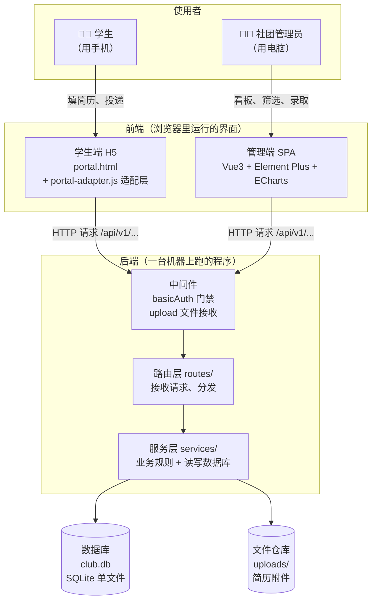

**看图要点（新手最容易搞混的）**：
- 学生端和管理端**从不直接读写数据库**。它们只会"喊话"（发 HTTP 请求），由后端决定给不给、怎么给。
- 中间件像**门卫**：`basicAuth` 检查你有没有密码，`upload` 负责接收上传的文件。
- 数据库只有一个文件（`club.db`），拷走它=备份了全部业务数据。

### 2.2 后端分层结构图

后端内部按"责任"分成三层，每层只干自己的事：

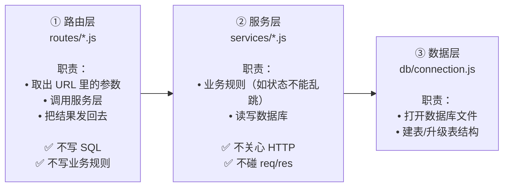

**为什么这样分？（新手必读）**
假设以后要做手机 App，只需要重写"路由层"（换成 App 能听懂的格式），服务层的规则和数据库完全不用动。
反过来，如果"招新人数不能少于已录取数"这条规则要改，只改服务层一处，前端、App、后台脚本全都自动生效。

### 2.3 前端结构图

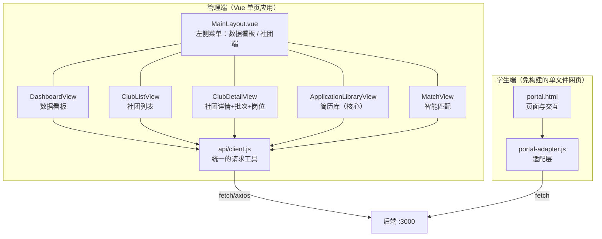

**"适配层"是什么？**
学生端原本是一个独立做的原型，它期望的数据格式（字段名）和后端给的不一样。
适配层就是**翻译官**：后端说 `description`，适配层翻译成原型认识的 `intro`；后端说 `positions[].title`，翻译成 `name`。
好处是：**后端一行都不用改**，学生端就能用真实数据。

---

## 3. 时序图（事情是按什么顺序发生的）

时序图回答的问题是：**从头到尾，谁先动、谁后动、传了什么。**

### 3.1 学生投递简历（最核心的流程）

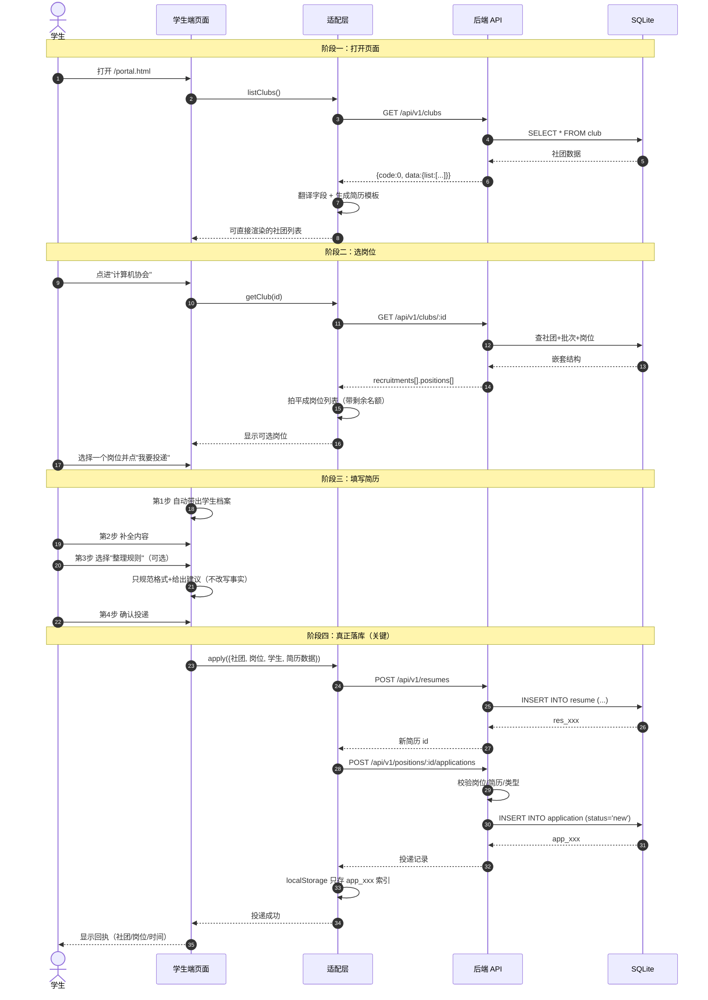

**新手重点理解**：
- "投递成功"这句话之所以可信，是因为它前面真的执行了两次数据库写入（简历 + 投递）。
- 浏览器只存了一个编号（`app_xxx`），内容全在服务器上——所以**换浏览器只是看不到历史列表，数据本身不会丢**。

### 3.2 管理员处理简历

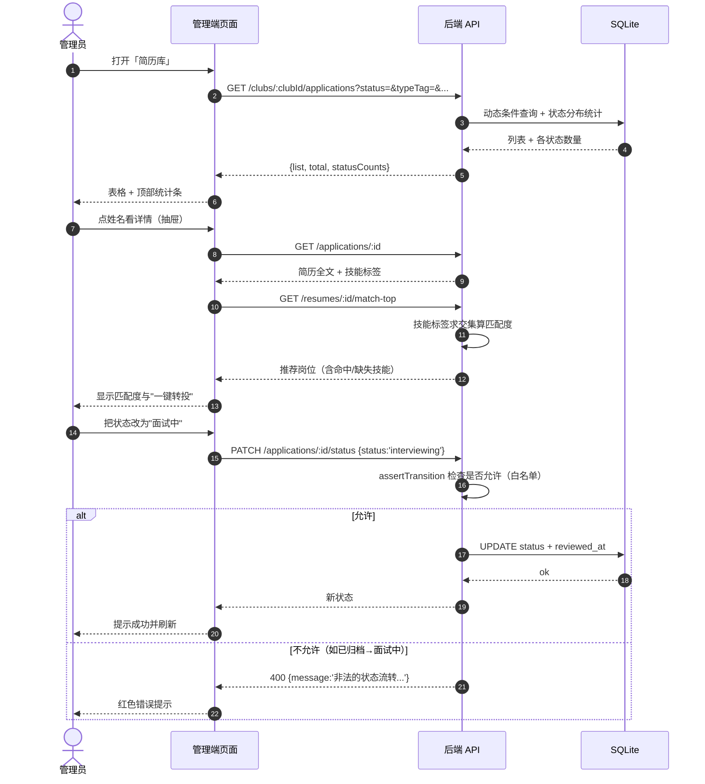

### 3.3 系统启动（后端开机自启时发生什么）

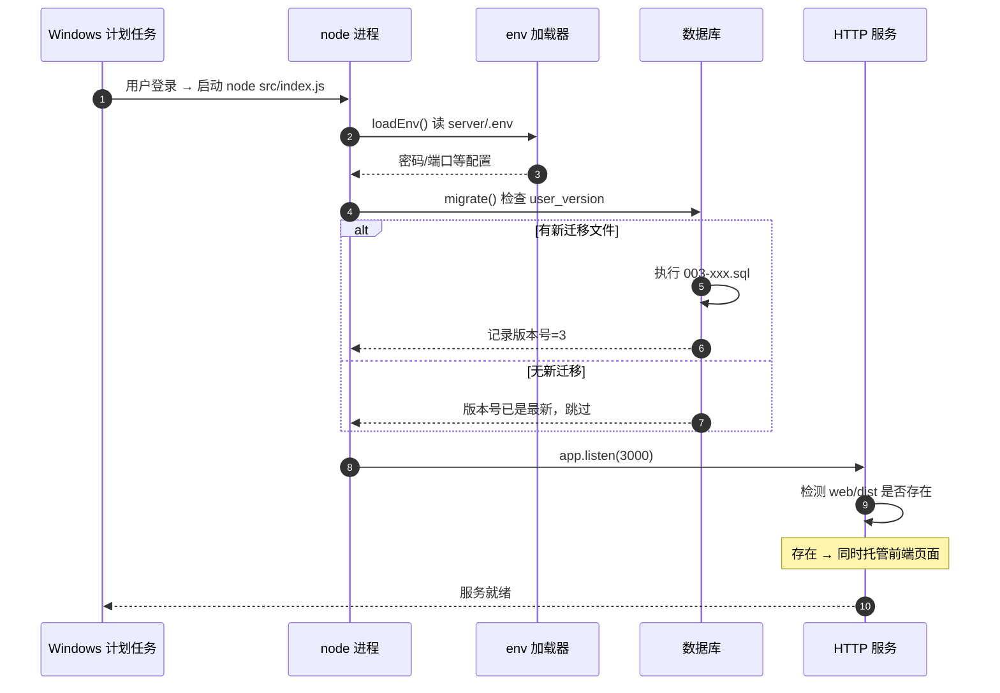

---

## 4. 数据流详解（数据从哪来、到哪去、变成什么）

### 4.1 三种数据，去三个地方

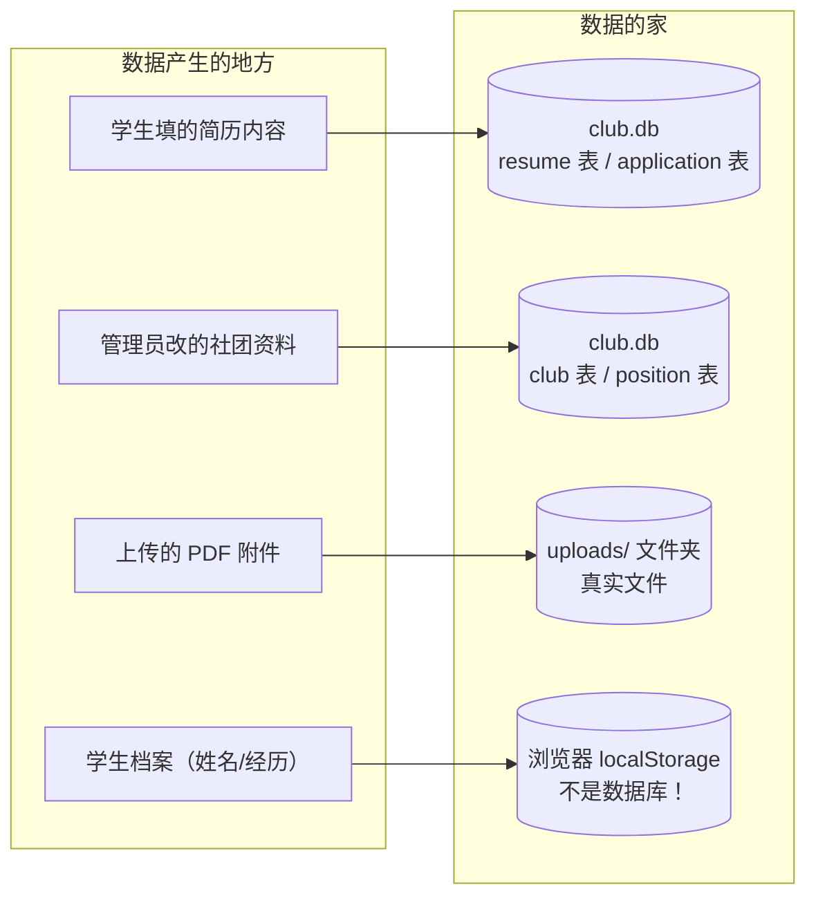

**为什么要区分 localStorage 和数据库？**
- **数据库**：所有"业务数据"（谁投了哪个岗位、社团招了几个人）——永久保存、多人共享、重启不丢。
- **localStorage**：只是**这台电脑这个浏览器**里的小本子，用来记住"我叫什么、我投过哪几份"。
  换个浏览器就空了，但服务端的数据一条都不会少。

### 4.2 一次投递，数据"变形记"

这是新手最该理解的一段：**同一份信息，在流动过程中换了三次样子。**

```
【第 1 次变形】学生在手机页面上填的（一堆输入框）
  姓名: 张三
  技术技能: Vue, Node.js
  代表项目作品描述: 二手交易平台，Vue3+Express...

        ↓ 适配层 apply() 把它拼成一段文本

【第 2 次变形】简历正文（content 字段，人可读的字符串）
  【姓名】
  张三

  【基本信息（学院/专业/年级）】
  计算机学院 · 软件工程 · 大二

  【技术技能】
  Vue, Node.js

  【代表项目作品描述】
  二手交易平台，Vue3+Express...

        ↓ POST /resumes → 后端 INSERT

【第 3 次变形】数据库里的一行（结构化字段）
  resume 表:
    id            = res_a1b2c3
    student_name  = 张三          ← 单独存，方便按姓名搜索
    skills        = Vue, Node.js  ← 单独存，用于智能匹配
    content       = "【姓名】\n张三\n\n…"  ← 整段存，用于展示
    major         = 软件工程
    grade         = 大二
  application 表:
    id            = app_x9y8z7
    position_id   = pos_前端开发干事
    resume_id     = res_a1b2c3
    status        = new           ← 新收到，等待社团处理
    type_tag      = technical     ← 从社团分类自动映射而来

        ↓ 管理端 GET /clubs/:id/applications

【第 4 次变形】管理端表格里的一行（多表拼出来的）
  张三 | 大二 | 软件工程 | 2026秋季招新·前端开发干事 | 技术型 | 新收到 | ☆☆☆☆☆
```

**新手注意**：为什么"技能"要单独存一列，而不是只留整段文本？
因为智能匹配需要**精确比对标签**（`Vue` vs `vue`），从一整段文字里猜技能不可靠。
这体现了数据库设计的一个原则：**要用来筛选/计算的字段，就单独给它一列。**

### 4.3 一条简历的完整生命周期

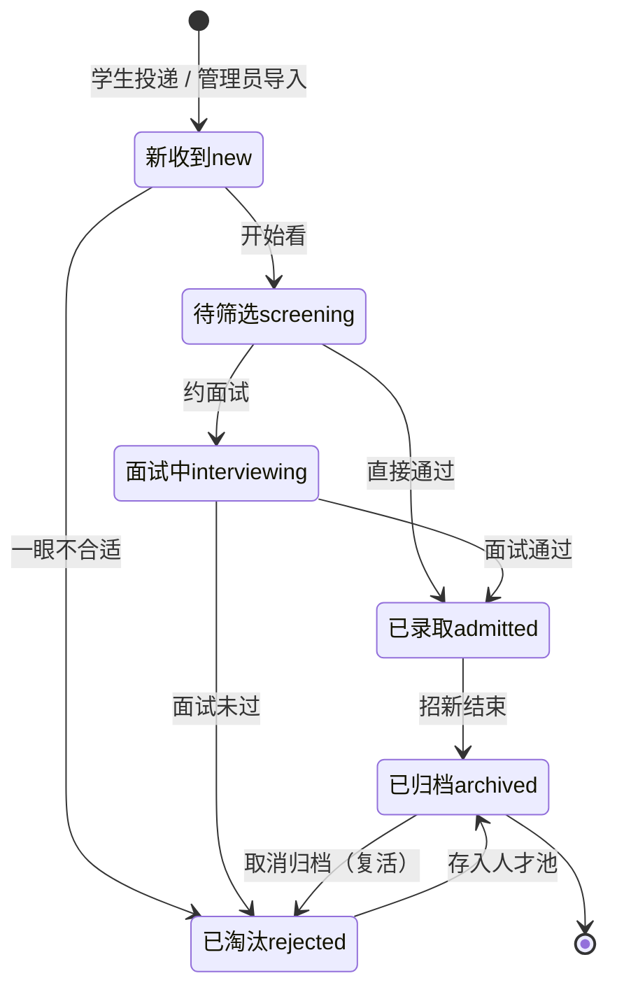

**两条重要规则**：
1. **不能跳步**：`新收到` 不能直接变 `已录取`（必须先经过筛选/面试），后端会拒绝并告诉你允许的下一步。
2. **归档不等于删除**：归档只是"这件事处理完了"，数据还在，随时能取消归档。

### 4.4 数据存在哪：一张地图

```
D:\GitHub库\社团\
├─ server\
│  ├─ data\
│  │  ├─ club.db          ← ★ 所有业务数据（社团/岗位/简历/投递）
│  │  ├─ club.db-wal      ← 数据库的"正在写入"暂存区（WAL 模式）
│  │  └─ club.db-shm      ← 数据库的索引共享内存
│  ├─ uploads\            ← 简历附件实体文件（PDF/图片）
│  └─ .env                ← 访问密码（不提交到 Git）
└─ web\
   └─ dist\               ← 前端构建产物（后端会自动托管它）
```

**备份方法（新手版）**：
```powershell
# 停服务 → 复制这两个地方 → 完成
Copy-Item "D:\GitHub库\社团\server\data" "$env:USERPROFILE\backup\data" -Recurse
Copy-Item "D:\GitHub库\社团\server\uploads" "$env:USERPROFILE\backup\uploads" -Recurse
```
（`club.db-wal` 里可能存着还没并入主库的最新写入，所以整个 `data` 文件夹一起拷。）

---

## 5. 部署拓扑（程序跑在哪、怎么连起来）

### 5.1 当前的实际部署（本机 Windows）

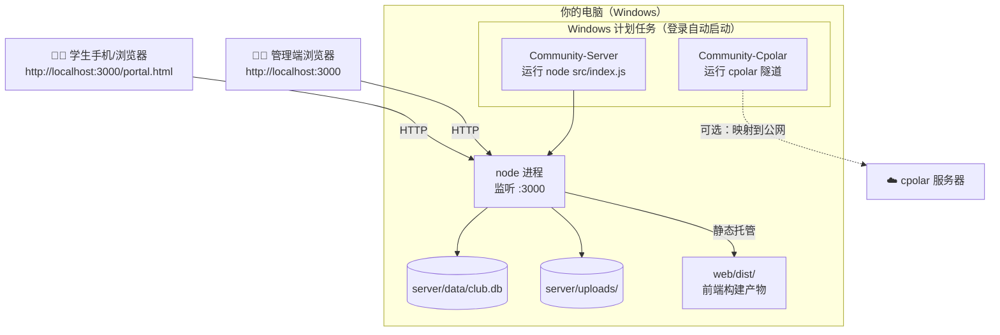

**新手理解要点**：
- **只有一个进程在对外服务**（node，监听 3000）。前端页面不是"另一个服务器"，而是被这个 node 顺手一起发出去的。
- 所以只要 3000 活着，管理端、学生端、API、附件全都能访问。
- 计划任务的作用：让你**不用每次开机手动敲命令**。

### 5.2 两种运行模式的区别

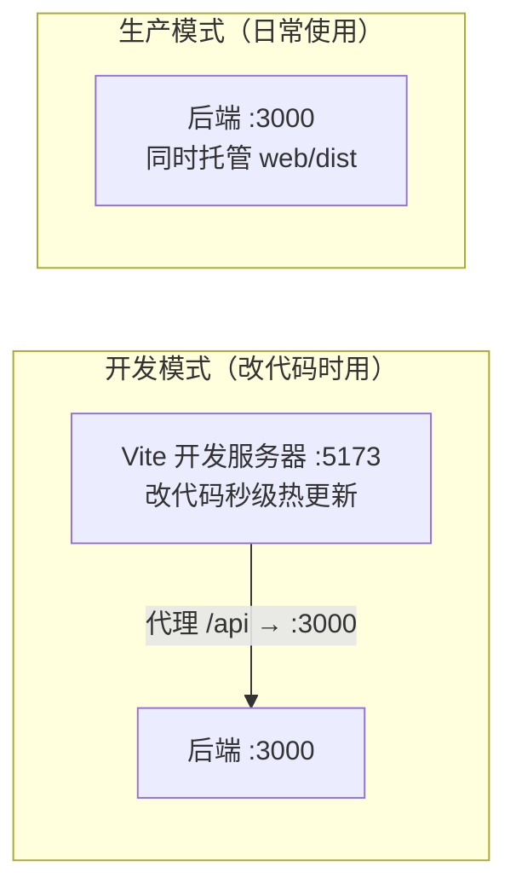

| | 开发模式 | 生产模式 |
|---|---|---|
| 启动命令 | 两个终端：`cd server && npm run dev`、`cd web && npm run dev` | `node src/index.js`（或计划任务） |
| 访问地址 | `http://localhost:5173` | `http://localhost:3000` |
| 改代码后 | 浏览器自动刷新 | 需要 `npm run build` 重新构建前端 |
| 用途 | 写代码、调界面 | 给真实用户用 |

**新手最常见的坑**：改了 Vue 代码，但访问的是 `:3000` → 看不到变化。因为 3000 用的是**上次构建的旧产物**，必须先 `npm run build`。

### 5.3 Docker 部署（换台机器时用）

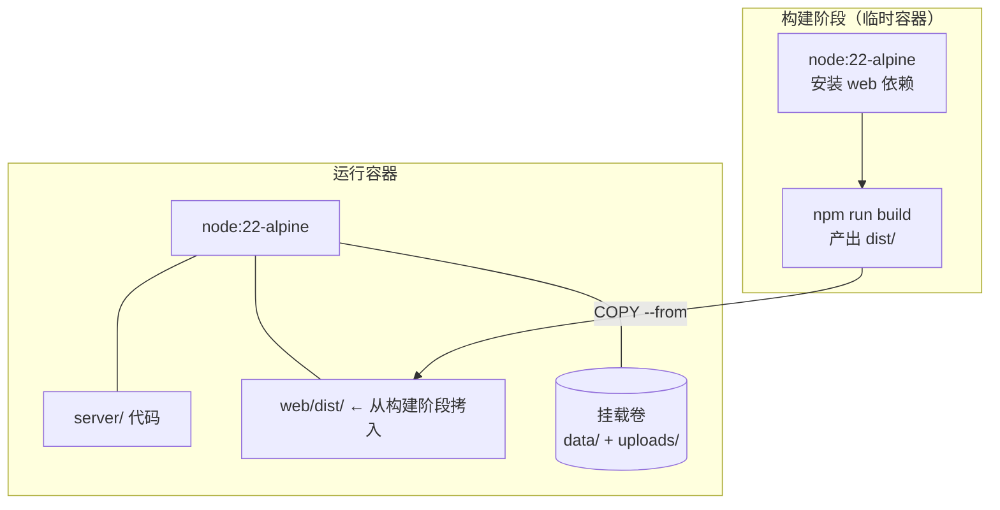

一条命令启动：`docker compose up -d --build` → 访问 `http://服务器IP:3000`。
**为什么数据要挂载卷**：容器删了重建，卷里的数据还在（否则每次更新都清空简历库）。

### 5.4 公网访问（可选，cpolar 隧道）

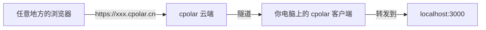

**两个新手必须知道的限制**：
1. 免费版域名是**随机**的，重启隧道会变（要固定得买保留域名）。
2. 你的电脑必须开着、cpolar 必须运行，公网才能访问（因为它本质是把**你家电脑**暴露出去）。

---

## 6. 新手速查表

| 我想… | 怎么做 |
|---|---|
| 启动系统 | 双击计划任务即可；或 `cd server; node src/index.js` |
| 改界面样式 | `cd web; npm run dev` → 改 `web/src/` → 浏览器 5173 实时看 |
| 让改动对外生效 | `cd web; npm run build` → 刷新 3000 页面 |
| 改业务规则（如状态流转） | 改 `server/src/services/applicationService.js` → 重启后端 |
| 加一个数据库字段 | 新建 `server/db/migrations/004-xxx.sql`（**不要改 001**）→ 重启后端自动执行 |
| 备份数据 | 复制 `server/data` 和 `server/uploads` 两个文件夹 |
| 看服务是否活着 | 打开 `http://localhost:3000/healthz`，返回 `{"code":0,...}` 就是正常 |
| 打不开页面 | ① 查 3000 是否在监听 ② 查计划任务是否 Running ③ 看 `healthz` |
| 忘记访问密码 | 打开 `server/.env` 看 `BASIC_AUTH_PASS`，或设 `BASIC_AUTH_DISABLE=1` 关闭 |

### 术语小词典

| 术语 | 通俗解释 |
|---|---|
| **API** | 后端开给前端的一组"办事窗口"，每个窗口对应一个功能 |
| **REST** | 一种 API 风格：用 URL 表示"东西"，用 GET/POST/PUT/DELETE 表示"对它做什么" |
| **路由** | 负责把请求分发给正确的处理函数（像前台分诊） |
| **中间件** | 请求到达目的地前经过的"关卡"（门禁、查文件大小、记日志） |
| **状态机** | 规定"事情只能按某些步骤往下走"的规则表 |
| **迁移（migration）** | 数据库结构的版本升级脚本，一个一个按顺序执行 |
| **SQLite** | 一个数据库就是一个文件，不需要单独安装数据库软件 |
| **WAL** | 数据库的一种写入方式，写的时候先记小本子，更安全也更快 |
| **SPA** | 单页应用：整个网站只有一个 HTML，切换页面由 JS 完成，不重新加载 |
| **构建（build）** | 把开发时的源码（Vue 组件等）打包成浏览器能直接跑的 JS/CSS |
| **代理（proxy）** | 开发时把 `/api` 请求转给后端，避免跨域问题 |
| **localStorage** | 浏览器自带的小仓库，只存在这台电脑的这个浏览器里 |
| **Promise / async-await** | 处理"要等一会儿才有结果"的操作（如网络请求）的写法 |

---

## 7. 后端目录速查（每个文件干什么）

```
server/src/
├─ index.js             入口：读配置 → 升级数据库 → 开始监听（11 行）
├─ app.js               装配：门禁、静态文件、7 组路由、错误兜底（87 行）
├─ db/connection.js     打开数据库 + 执行迁移（32 行）
├─ utils/
│  ├─ id.js             生成带前缀的随机编号（club_xxx / app_xxx）
│  ├─ respond.js        统一返回格式 ok() + 分页参数归一化
│  ├─ errors.js         业务异常类与快捷方法（notFound/badRequest）
│  └─ env.js            极简 .env 读取器
├─ middlewares/
│  ├─ basicAuth.js      访问密码校验（可开关）
│  └─ upload.js         接收简历附件（限 10MB、限扩展名）
├─ routes/              7 个"分诊台"，每个路由约 3 行
│  clubRoutes / recruitmentRoutes / positionRoutes / resumeRoutes
│  applicationRoutes / matchRoutes / dashboardRoutes
└─ services/            业务大脑
   ├─ clubService.js            社团增删改查、详情树
   ├─ recruitmentService.js     招新批次、状态、删除保护
   ├─ positionService.js        岗位、招新人数校验
   ├─ resumeService.js          简历创建/更新
   ├─ applicationService.js     ★ 状态机 + 归档 + 六维筛选 + 导出
   ├─ matchService.js           技能匹配引擎
   └─ dashboardService.js       看板统计聚合
```

---

## 8. 前端目录速查

```
web/
├─ public/                     ← 不参与打包，原样复制到 dist
│  ├─ portal.html              学生端页面（手机风格）
│  └─ portal-adapter.js        学生端适配层（翻译官 + 真实投递）
├─ src/                        ← 管理端源码（需要构建）
│  ├─ main.js                  创建应用、装 Element Plus、注册图标
│  ├─ App.vue                  根组件（只放一个 router-view）
│  ├─ router/index.js          路由表（含侧边栏分区标记 meta.group）
│  ├─ layout/MainLayout.vue    框架：左侧菜单 + 顶部面包屑
│  ├─ api/client.js            axios 实例 + 响应拦截器（统一解包/报错）
│  ├─ api/index.js             按资源分组的接口函数
│  ├─ components/EChart.vue    ECharts 封装（自适应 + 自动销毁）
│  └─ views/                   5 个页面
│     ├─ DashboardView.vue         看板：指标卡/漏斗/趋势/分布/进度
│     ├─ ClubListView.vue          社团列表 + 新建
│     ├─ ClubDetailView.vue        社团详情 + 批次 + 岗位管理
│     ├─ ApplicationLibraryView.vue 简历库（筛选/流转/评分/归档/导出）
│     └─ MatchView.vue             智能匹配与转岗建议
└─ vite.config.js              开发服务器配置（端口 + /api 代理）
```

---

**遇到看不懂的地方**：先回到第 1 节的"市场比喻"，把术语替换成现实中的角色，通常就明白了。
