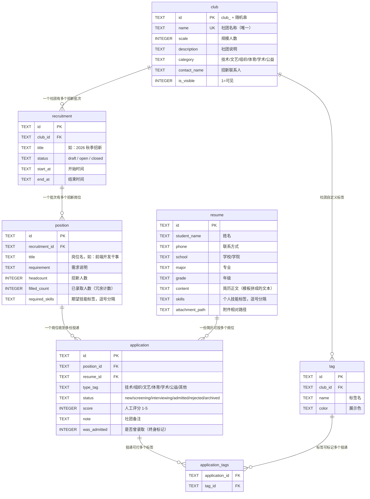
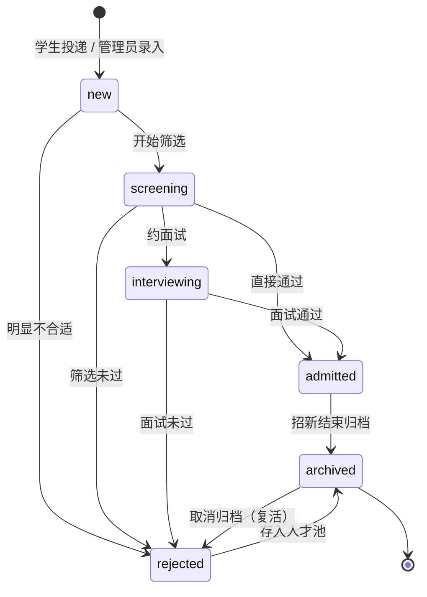

# 数据模型设计

> 版本：v0.3　|　对应实现：`server/db/migrations/001~003*.sql`

## ER 图



**关系读法**：`club ||--o{ recruitment` 表示"一个社团对应零到多个批次"（一条竖线=恰好一个，`o{`=零或多）。
唯一约束 `UNIQUE(position_id, resume_id)` 保证同一份简历不能重复投同一个岗位。

## 表结构（SQLite DDL）

### club —— 社团

| 字段 | 类型 | 说明 |
|---|---|---|
| id | TEXT PK | ULID/随机 id |
| name | TEXT NOT NULL UNIQUE | 社团名称 |
| scale | INTEGER | 规模（现有人数） |
| scale_label | TEXT | 规模档位展示（可选：<50 / 50-200 / >200） |
| description | TEXT | 社团说明（支持 Markdown/富文本） |
| category | TEXT | 社团类型（技术/文艺/体育/公益/学术…） |
| logo_path | TEXT | 社团 Logo 文件相对路径 |
| contact_name / contact_phone / contact_email | TEXT | 招新联系人（负责人） |
| is_visible | INTEGER(0/1) | 是否对外可见，默认 1 |
| created_at / updated_at | TEXT | ISO8601 |

### recruitment —— 招新批次

| 字段 | 类型 | 说明 |
|---|---|---|
| id | TEXT PK | |
| club_id | TEXT FK → club.id | 所属社团 |
| title | TEXT | 批次名（如 "2026 秋季招新"） |
| status | TEXT | `draft / open / closed` |
| start_at / end_at | TEXT | 招新起止时间（可空） |
| remark | TEXT | 备注 |
| created_at / updated_at | TEXT | |

索引：`(club_id, status)`。

### position —— 招新岗位需求（"招新需求 + 招新人数"）

| 字段 | 类型 | 说明 |
|---|---|---|
| id | TEXT PK | |
| recruitment_id | TEXT FK → recruitment.id | 所属批次 |
| title | TEXT | 岗位名（如 "前端开发干事"） |
| requirement | TEXT | 需求说明（Markdown） |
| headcount | INTEGER | 招新人数 |
| filled_count | INTEGER | 已录取人数（冗余计数，见下方"招满计数"） |
| **required_skills** | TEXT | **期望技能标签**，逗号分隔（迁移 003 新增，用于智能匹配，如 `HTML,CSS,Vue`） |
| sort_order | INTEGER | 展示排序 |
| created_at / updated_at | TEXT | |

索引：`(recruitment_id)`。

### resume —— 简历（学生侧信息）

| 字段 | 类型 | 说明 |
|---|---|---|
| id | TEXT PK | |
| student_name | TEXT | 姓名 |
| phone | TEXT | 联系方式 |
| email | TEXT | 邮箱 |
| school | TEXT | 学校 |
| major | TEXT | 专业 |
| grade | TEXT | 年级（大一/大二…） |
| content | TEXT | 简历正文（学生端按模板字段拼成的可读文本） |
| attachment_path | TEXT | 附件相对路径（PDF/图片） |
| **skills** | TEXT | **个人技能标签**，逗号分隔（迁移 003 新增，如 `Vue,设计,活动组织`） |
| created_at / updated_at | TEXT | |

### application —— 投递记录（简历归档核心）

| 字段 | 类型 | 说明 |
|---|---|---|
| id | TEXT PK | |
| position_id | TEXT FK → position.id | 投向的岗位（= 按需求归档的落点） |
| resume_id | TEXT FK → resume.id | 简历 |
| type_tag | TEXT | 简历类型标签（如 `technical/organizing/artistic`），见下方枚举 |
| status | TEXT | `new / screening / interviewing / admitted / rejected / archived` |
| score | INTEGER | 社团评分 1-5（可空） |
| note | TEXT | 社团备注 |
| reviewed_at | TEXT | 最近一次处理时间 |
| **was_admitted** | INTEGER | **是否曾经录取**（迁移 002 新增）：一旦录取即置 1 且终身保留，用于招满计数 |
| created_at / updated_at | TEXT | |

唯一约束：`UNIQUE(position_id, resume_id)` —— 同一岗位不能重复投递。
索引：`(position_id)`、`(resume_id)`、`(type_tag, status)`。

### application_tags —— 简历×自定义标签（多对多）

| 字段 | 类型 |
|---|---|
| application_id | TEXT FK |
| tag_id | TEXT FK |

### tag —— 自定义标签

| 字段 | 类型 | 说明 |
|---|---|---|
| id | TEXT PK | |
| club_id | TEXT FK | 标签属于某个社团（可空=系统通用） |
| name | TEXT | 标签名 |
| color | TEXT | 展示色 |

## 状态机（application.status）



**流转白名单**（`STATUS_TRANSITIONS`，前后端共用同一份规则）：

| 当前状态 | 允许的下一状态 |
|---|---|
| `new` 新收到 | screening / rejected / archived |
| `screening` 待筛选 | interviewing / rejected / admitted / archived |
| `interviewing` 面试中 | admitted / rejected / archived |
| `admitted` 已录取 | archived |
| `rejected` 已淘汰 | archived |
| `archived` 已归档 | （终态，需先取消归档） |

合法跳转白名单在 service 层校验（见 `server/src/services/applicationService.js` 的 `STATUS_TRANSITIONS`），
并通过 `GET /api/v1/dict` 下发给前端复用，保证前后端规则一致。

归档是**特例操作**（`setArchived`）：归档时直接置 `status='archived'` 且保留 `was_admitted`；
取消归档则回到 `rejected`（人才池复盘场景）。

## 招满计数（filled_count）

```
position.filled_count  = COUNT(application WHERE position_id=? AND was_admitted = 1)
```

- **为什么冗余**：简历库列表一次展示 N 个岗位，若每次实时 COUNT 会产生 N 次子查询。
- **为什么用 `was_admitted` 而非 `status='admitted'`**：录取者后续被"归档"后状态不再等于 admitted，
  早期实现会导致招满数归零（迁移 002 修复此缺陷）。
- **一致性保证**：所有影响录取的操作（状态流转 / 归档 / 删除）统一调用
  `refreshPositionFilledCount(positionId)` 重算，只有一个写入口。

## 归档语义

- **按需求归档**：`application.position_id` 决定档案落点，查询路径
  `club → recruitment → position → applications`。
- **按类型归档**：`type_tag` 交叉筛选（`tag` / `application_tags` 表为自由打标预留，前端未启用）。
- 导出 CSV 字段：姓名/类型/状态/评分/岗位/招新批次/学校/专业/年级/投递时间/备注。

## 学生端数据落点

| 数据 | 存储位置 | 说明 |
|---|---|---|
| 简历正文与基本信息 | `resume` 表（SQLite） | 学生端投递时 `POST /resumes` 真实落库 |
| 投递记录 | `application` 表（SQLite） | `POST /positions/:id/applications`，状态从 `new` 开始 |
| 简历类型标签 | `application.type_tag` | 由社团分类自动映射（技术→technical 等） |
| 学生档案（姓名/经历/奖项…） | 浏览器 localStorage | 免重复填写；换浏览器需重填 |
| 投递记录索引 | 浏览器 localStorage | **仅存 applicationId**，状态每次从服务端拉取最新值 |

> 设计意图：**业务数据全部在服务端**，浏览器只做缓存与索引，清缓存不丢数据。

## 迁移历史

| 迁移文件 | 变更 | 原因 |
|---|---|---|
| `001-init.sql` | 建立全部 6 张表（club/recruitment/position/resume/application/tag+application_tags） | 初始结构 |
| `002-add-was-admitted.sql` | `application` 加 `was_admitted` 列 + 存量回填 | 修复"录取后归档导致 filled_count 归零" |
| `003-add-skill-tags.sql` | `resume.skills`、`position.required_skills` 列 + 演示数据回填 | 支撑技能标签智能匹配 |

迁移机制：`connection.js` 用 SQLite 内置 `PRAGMA user_version` 记录已执行数量，启动时只跑新增迁移（幂等）。

## 数据字典（type_tag 枚举）

| 值 | 中文 |
|---|---|
| technical | 技术型 |
| organizing | 组织策划型 |
| artistic | 文艺特长型 |
| sports | 体育型 |
| academic | 学术竞赛型 |
| service | 志愿服务型 |
| other | 其他 |

> 状态文案字典（`new/screening/interviewing/admitted/rejected/archived` → 新收到/待筛选/面试中/已录取/已淘汰/已归档）
> 与学生端展示文案（已送达/筛选中/面试中/已录取/未通过/已归档）在 `portal-adapter.js` 的 `STATUS_LABEL` 中定义。
