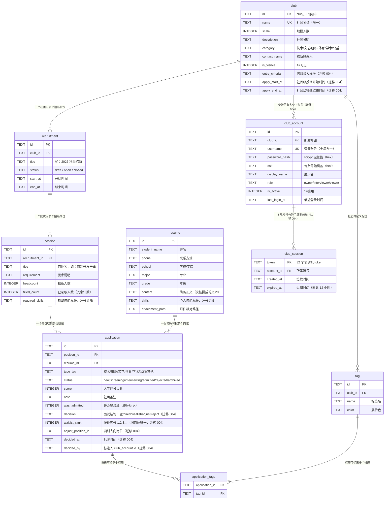
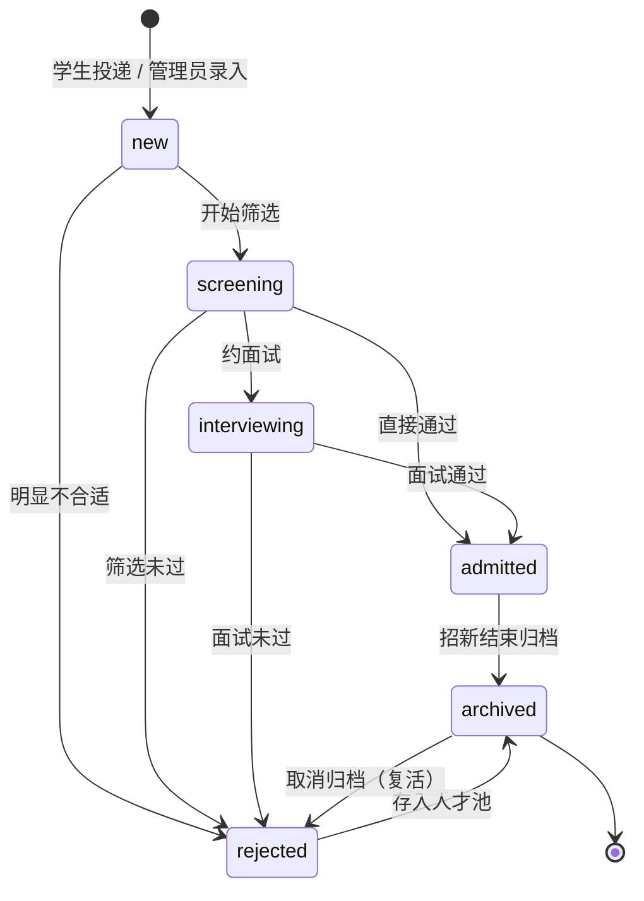

# 数据模型设计

> 版本：v0.4　|　对应实现：`server/db/migrations/001~004*.sql`

## ER 图



**关系读法**：`club ||--o{ recruitment` 表示"一个社团对应零到多个批次"（一条竖线=恰好一个，`o{`=零或多）。
唯一约束 `UNIQUE(position_id, resume_id)` 保证同一份简历不能重复投同一个岗位。

## 表结构（SQLite DDL）

### club —— 社团

| 字段 | 类型 | 说明 |
|---|---|---|
| id | TEXT PK | ULID/随机 id |
| name | TEXT NOT NULL UNIQUE | 社团名称 |
| scale | INTEGER | 规模（现有人数） |
| scale_label | TEXT | 规模档位展示（可选：<50 / 50-200 / >200） |
| description | TEXT | 社团说明（支持 Markdown/富文本） |
| category | TEXT | 社团类型（技术/文艺/体育/公益/学术…） |
| logo_path | TEXT | 社团 Logo 文件相对路径 |
| contact_name / contact_phone / contact_email | TEXT | 招新联系人（负责人） |
| is_visible | INTEGER(0/1) | 是否对外可见，默认 1 |
| **entry_criteria** | TEXT NOT NULL DEFAULT '' | **信息录入标准**（迁移 004 新增）：告诉投递者要提交什么、达到什么条件；与 `description`（社团介绍）职责分开 |
| **apply_start_at** | TEXT | **社团级投递开始时间**（迁移 004 新增，可空）。批次上的 `start_at` 优先级更高，未填时回落到这里 |
| **apply_end_at** | TEXT | **社团级投递结束时间**（迁移 004 新增，可空），回落规则同上 |
| created_at / updated_at | TEXT | ISO8601 |

### recruitment —— 招新批次

| 字段 | 类型 | 说明 |
|---|---|---|
| id | TEXT PK | |
| club_id | TEXT FK → club.id | 所属社团 |
| title | TEXT | 批次名（如 "2026 秋季招新"） |
| status | TEXT | `draft / open / closed` |
| start_at / end_at | TEXT | 招新起止时间（可空） |
| remark | TEXT | 备注 |
| created_at / updated_at | TEXT | |

索引：`(club_id, status)`。

### position —— 招新岗位需求（"招新需求 + 招新人数"）

| 字段 | 类型 | 说明 |
|---|---|---|
| id | TEXT PK | |
| recruitment_id | TEXT FK → recruitment.id | 所属批次 |
| title | TEXT | 岗位名（如 "前端开发干事"） |
| requirement | TEXT | 需求说明（Markdown） |
| headcount | INTEGER | 招新人数 |
| filled_count | INTEGER | 已录取人数（冗余计数，见下方"招满计数"） |
| **required_skills** | TEXT | **期望技能标签**，逗号分隔（迁移 003 新增，用于智能匹配，如 `HTML,CSS,Vue`） |
| sort_order | INTEGER | 展示排序 |
| created_at / updated_at | TEXT | |

索引：`(recruitment_id)`。

### resume —— 简历（学生侧信息）

| 字段 | 类型 | 说明 |
|---|---|---|
| id | TEXT PK | |
| student_name | TEXT | 姓名 |
| phone | TEXT | 联系方式 |
| email | TEXT | 邮箱 |
| school | TEXT | 学校 |
| major | TEXT | 专业 |
| grade | TEXT | 年级（大一/大二…） |
| content | TEXT | 简历正文（学生端按模板字段拼成的可读文本） |
| attachment_path | TEXT | 附件相对路径（PDF/图片） |
| **skills** | TEXT | **个人技能标签**，逗号分隔（迁移 003 新增，如 `Vue,设计,活动组织`） |
| created_at / updated_at | TEXT | |

### application —— 投递记录（简历归档核心）

| 字段 | 类型 | 说明 |
|---|---|---|
| id | TEXT PK | |
| position_id | TEXT FK → position.id | 投向的岗位（= 按需求归档的落点） |
| resume_id | TEXT FK → resume.id | 简历 |
| type_tag | TEXT | 简历类型标签（如 `technical/organizing/artistic`），见下方枚举 |
| status | TEXT | `new / screening / interviewing / admitted / rejected / archived` |
| score | INTEGER | 社团评分 1-5（可空） |
| note | TEXT | 社团备注 |
| reviewed_at | TEXT | 最近一次处理时间 |
| **was_admitted** | INTEGER | **是否曾经录取**（迁移 002 新增）：一旦录取即置 1 且终身保留，用于招满计数 |
| **decision** | TEXT NOT NULL DEFAULT '' | **面试结论**（迁移 004 新增）：`''` 未定 / `hired` 录用 / `waitlist` 候补 / `adjust` 调剂 / `reject` 淘汰，见下一节 |
| **waitlist_rank** | INTEGER | **候补序号**（迁移 004 新增）：1,2,3…，同岗位内唯一，可空 |
| **adjust_position_id** | TEXT | **调剂去向岗位**（迁移 004 新增）：指向 position.id（SQL 层未建外键，由 service 校验"同社团、且不是当前岗位"） |
| **decided_at** | TEXT | **标注时间**（迁移 004 新增），撤销结论时置空 |
| **decided_by** | TEXT | **标注人**（迁移 004 新增）：`club_account.id`，撤销结论时置空 |
| created_at / updated_at | TEXT | |

唯一约束：`UNIQUE(position_id, resume_id)` —— 同一岗位不能重复投递。
索引：`(position_id)`、`(resume_id)`、`(type_tag, status)`、
`idx_application_decision(position_id, decision)`、`idx_application_waitlist(position_id, waitlist_rank)`（后两个为迁移 004 新增，分别支撑"按结论筛选"与"候补队列按序号取队首"）。

### application_tags —— 简历×自定义标签（多对多）

| 字段 | 类型 |
|---|---|
| application_id | TEXT FK |
| tag_id | TEXT FK |

### tag —— 自定义标签

| 字段 | 类型 | 说明 |
|---|---|---|
| id | TEXT PK | |
| club_id | TEXT FK | 标签属于某个社团（可空=系统通用） |
| name | TEXT | 标签名 |
| color | TEXT | 展示色 |

### club_account —— 社团子账号（按人权限，迁移 004 新增）

| 字段 | 类型 | 说明 |
|---|---|---|
| id | TEXT PK | `acct_` + 随机串 |
| club_id | TEXT NOT NULL FK → club.id | 所属社团（`ON DELETE CASCADE`） |
| username | TEXT NOT NULL UNIQUE | 登录账号名（全局唯一） |
| password_hash | TEXT NOT NULL | 口令的 scrypt 派生值（hex），不落明文 |
| salt | TEXT NOT NULL | 每账号随机盐（hex） |
| display_name | TEXT | 展示名（默认取账号名） |
| role | TEXT NOT NULL DEFAULT 'interviewer' | `owner / interviewer / viewer`，SQL 层 `CHECK` 约束 |
| is_active | INTEGER NOT NULL DEFAULT 1 | 1=启用；停用后会话立即失效 |
| last_login_at | TEXT | 最近登录时间 |
| created_at / updated_at | TEXT | |

索引：`idx_club_account_club(club_id)`。
业务约束（`authService` 保证）：每个社团至少保留一个启用状态的 `owner`（改角色、停用、删除都拦）；
不能删除自己正在使用的账号；密码至少 6 位。

### club_session —— 社团端登录会话（迁移 004 新增）

| 字段 | 类型 | 说明 |
|---|---|---|
| token | TEXT PK | 32 字节随机数（hex），仅存服务端 |
| account_id | TEXT NOT NULL FK → club_account.id | 所属账号（`ON DELETE CASCADE`） |
| created_at | TEXT | 签发时间 |
| expires_at | TEXT | 过期时间，默认签发后 12 小时（`CLUB_SESSION_HOURS` 可覆盖） |

索引：`idx_club_session_account(account_id)`。
退出登录即删行；改密会删掉该账号的全部会话（强制下线）；过期会话在解析时顺手清理，启动时另做一次批量清理。

### 角色与能力矩阵（`club_account.role`）

能力（capability）矩阵是"每个人的权限"的唯一事实来源，定义在 `server/src/services/authService.js`
的 `ROLE_CAPABILITIES`，并经 `GET /api/v1/dict` 下发给前端（前端只用它隐藏按钮，真正拦截在后端中间件）：

| 角色 | 中文 | 能力 |
|---|---|---|
| `owner` | 社长 / 管理员 | `club:edit`、`recruitment:edit`、`position:edit`、`application:read`、`application:decide`、`dashboard:read`、`account:manage` |
| `interviewer` | 面试官 | `application:read`、`application:decide`、`dashboard:read` |
| `viewer` | 观察员 | `application:read`、`dashboard:read` |

权限判定顺序：先"登录了吗"（401）→ 再"角色够不够"（403）→ 再"是不是自己社团的数据"（403），
见 `server/src/middlewares/clubAuth.js` 的 `requireLogin` / `requireCapability` / `requireOwnClub`。

## 状态机（application.status）



**流转白名单**（`STATUS_TRANSITIONS`，前后端共用同一份规则）：

| 当前状态 | 允许的下一状态 |
|---|---|
| `new` 新收到 | screening / rejected / archived |
| `screening` 待筛选 | interviewing / rejected / admitted / archived |
| `interviewing` 面试中 | admitted / rejected / archived |
| `admitted` 已录取 | archived |
| `rejected` 已淘汰 | archived |
| `archived` 已归档 | （终态，需先取消归档） |

合法跳转白名单在 service 层校验（见 `server/src/services/applicationService.js` 的 `STATUS_TRANSITIONS`），
并通过 `GET /api/v1/dict` 下发给前端复用，保证前后端规则一致。

归档是**特例操作**（`setArchived`）：归档时直接置 `status='archived'` 且保留 `was_admitted`；
取消归档则回到 `rejected`（人才池复盘场景）。

## 面试决策层（decision）

`application` 上有**两层并行**的字段，迁移 004 新增的 `decision` 与既有状态机 `status` 互不覆盖：

| 层 | 字段 | 回答的问题 |
|---|---|---|
| 流程状态 | `status` | 这份投递**走到哪一步**（新收到 → 待筛选 → 面试中 → 已录取/已淘汰 → 已归档） |
| 面试结论 | `decision` | 面试的**结论是什么**（录用 / 候补 / 调剂 / 淘汰） |

**为什么拆成两层而不是往 status 里加状态**：面试结束时要同时表达两件事——
"这个人录用了，名额 +1"与"这个人是候补 1 号，先不占名额、但一旦有人放弃就按序号补上"。
后者是一种**不改变流程、只决定录用顺序**的结论；若把它塞进 `status`，状态机会多出
`waitlisted` 这类非终点状态，`filled_count` 的统计口径（`was_admitted=1`）也会被污染。
拆开之后，`status` 状态机的白名单与 `filled_count` 口径**完全不变**，迁移 004 只是并行加了一层标注。

### 枚举值

| 值 | 中文 | 流程副作用（`decisionService.setDecision`，同一事务内执行） |
|---|---|---|
| `''` | 未决定 | 撤销结论；若原为 `admitted` 则退回 `interviewing` 并把 `was_admitted` 清 0、重算 `filled_count` |
| `hired` | 录用 | 复用既有状态机推进到 `admitted`（置 `was_admitted=1` 并重算岗位 `filled_count`） |
| `waitlist` | 候补 | 分配候补序号；**不改流程状态、不占名额** |
| `adjust` | 调剂 | 记录调剂去向岗位（必须同社团、且不是当前岗位）；不改流程状态 |
| `reject` | 淘汰 | 复用既有状态机推进到 `rejected` |

`''` 之外的合法值以 `decisionService.DECISIONS`（`['hired','waitlist','adjust','reject']`）为准，
标签与徽章颜色（`DECISION_LABELS` / `DECISION_COLORS`）随 `GET /api/v1/dict` 的 `decisions` 下发。

### 候补序号唯一性与递补规则

- `waitlist_rank` 只在 `decision='waitlist'` 时有意义，取值范围 1,2,3…；
  **同岗位内唯一**：标注时会查同岗位是否已占用该序号，重复则报 400（避免出现两个"候补 1 号"）。
  不传序号时默认取当前同岗位候补序号最大值 +1（即排到队尾）。
- 候补队列 = `decision='waitlist'` 且按 `waitlist_rank` 升序，**序号即递补顺序，1 号永远最优先**。
- **递补**（`promoteWaitlist`）：把队首（或指定的某位候补）提升为 `hired`（即 `status→admitted`，
  占用一个名额），然后把该岗位剩余候补的序号**自动前移**重排为 1,2,3…，
  这样"招满员"就是"淘汰/放弃一个 → 递补一个"的收口动作。索引
  `idx_application_waitlist(position_id, waitlist_rank)` 正是为"取队首 + 重排"服务。

### 存量回填

迁移 004 会把 `status='admitted'` 的既有记录补成 `decision='hired'`
（`decided_at` 取 `COALESCE(reviewed_at, updated_at)`），保证看板、统计条与 CSV 的口径一致。

## 招满计数（filled_count）

```
position.filled_count  = COUNT(application WHERE position_id=? AND was_admitted = 1)
```

- **为什么冗余**：简历库列表一次展示 N 个岗位，若每次实时 COUNT 会产生 N 次子查询。
- **为什么用 `was_admitted` 而非 `status='admitted'`**：录取者后续被"归档"后状态不再等于 admitted，
  早期实现会导致招满数归零（迁移 002 修复此缺陷）。
- **一致性保证**：所有影响录取的操作（状态流转 / 归档 / 删除）统一调用
  `refreshPositionFilledCount(positionId)` 重算，只有一个写入口。

## 归档语义

- **按需求归档**：`application.position_id` 决定档案落点，查询路径
  `club → recruitment → position → applications`。
- **按类型归档**：`type_tag` 交叉筛选（`tag` / `application_tags` 表为自由打标预留，前端未启用）。
- 导出 CSV 字段：姓名/类型/状态/**面试结论/候补序号/调剂去向**/评分/岗位/招新批次/学校/专业/年级/投递时间/备注。

## 学生端数据落点

| 数据 | 存储位置 | 说明 |
|---|---|---|
| 简历正文与基本信息 | `resume` 表（SQLite） | 学生端投递时 `POST /resumes` 真实落库 |
| 投递记录 | `application` 表（SQLite） | `POST /positions/:id/applications`，状态从 `new` 开始 |
| 简历类型标签 | `application.type_tag` | 由社团分类自动映射（技术→technical 等） |
| 学生档案（姓名/经历/奖项…） | 浏览器 localStorage | 免重复填写；换浏览器需重填 |
| 投递记录索引 | 浏览器 localStorage | **仅存 applicationId**，状态每次从服务端拉取最新值 |

> 设计意图：**业务数据全部在服务端**，浏览器只做缓存与索引，清缓存不丢数据。

## 迁移历史

| 迁移文件 | 变更 | 原因 |
|---|---|---|
| `001-init.sql` | 建立全部 6 张表（club/recruitment/position/resume/application/tag+application_tags） | 初始结构 |
| `002-add-was-admitted.sql` | `application` 加 `was_admitted` 列 + 存量回填 | 修复"录取后归档导致 filled_count 归零" |
| `003-add-skill-tags.sql` | `resume.skills`、`position.required_skills` 列 + 演示数据回填 | 支撑技能标签智能匹配 |
| `004-club-console.sql` | `club` 加 `entry_criteria`/`apply_start_at`/`apply_end_at`；`application` 加 `decision`/`waitlist_rank`/`adjust_position_id`/`decided_at`/`decided_by` + 2 个索引 + 存量回填；新建 `club_account`/`club_session` 两张表 | 社团端改造：招新广场双面板、录入标准与投递时间、面试决策与候补递补、按人权限与登录 |

> 迁移 004 只新增列 / 新增表，**不改动** 001~003 的既有列与状态机语义，
> 因此已落库数据与 `filled_count` 的统计口径完全不变。

迁移机制：`connection.js` 用 SQLite 内置 `PRAGMA user_version` 记录已执行数量，启动时只跑新增迁移（幂等）。

## 数据字典（type_tag 枚举）

| 值 | 中文 |
|---|---|
| technical | 技术型 |
| organizing | 组织策划型 |
| artistic | 文艺特长型 |
| sports | 体育型 |
| academic | 学术竞赛型 |
| service | 志愿服务型 |
| other | 其他 |

> 状态文案字典（`new/screening/interviewing/admitted/rejected/archived` → 新收到/待筛选/面试中/已录取/已淘汰/已归档）
> 与学生端展示文案（已送达/筛选中/面试中/已录取/未通过/已归档）在 `portal-adapter.js` 的 `STATUS_LABEL` 中定义。
