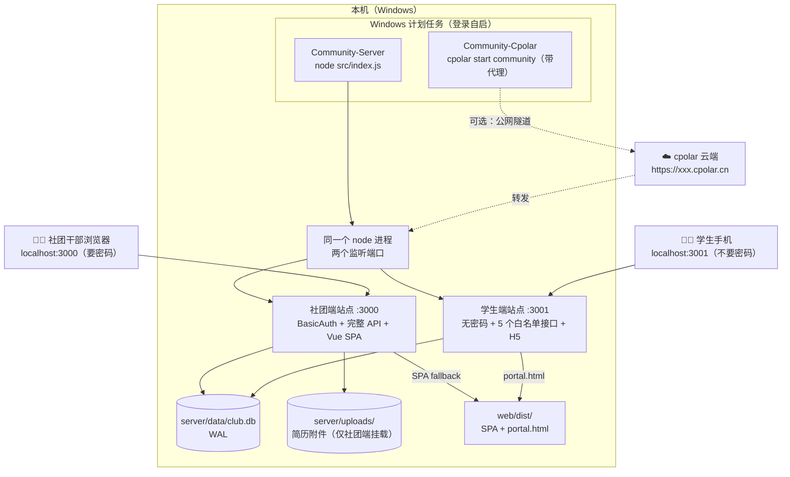
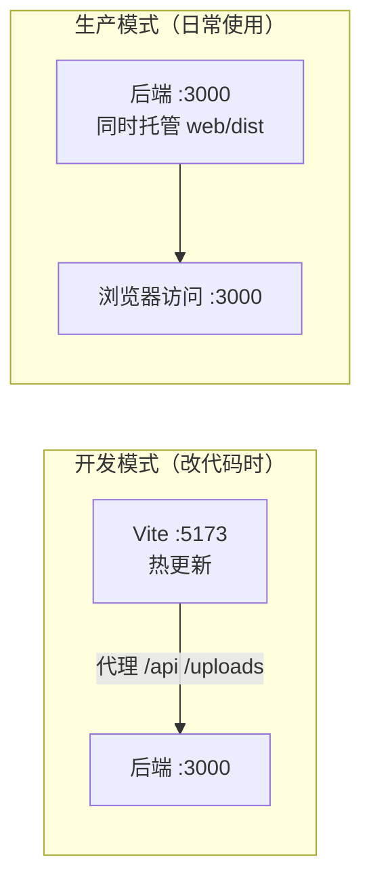

# 部署指南

三种运行方式，按场景选择：

## 0. 当前部署状态（本机 Windows）

- 已注册开机自启计划任务（登录 Windows 自动运行）：
  - `Community-Server` —— 后端 node 服务（:3000）
  - `Community-Cpolar` —— cpolar 公网隧道
- 注册命令见 `scripts/install-services.ps1`（node 部分）；
  cpolar 隧道配置位于 `~/.cpolar/cpolar.yml`（community → :3000）。
- 公网访问受 **HTTP Basic Auth** 保护，凭据在 `server/.env`
  （`BASIC_AUTH_USER` / `BASIC_AUTH_PASS`），该文件不入库。
  用 `BASIC_AUTH_DISABLE=1` 可关闭密码（仅建议本机使用）。
- 免费版 cpolar 公网域名是**随机的**，重启隧道后变化；
  查看当前地址：`Get-Content "$env:USERPROFILE\.cpolar\run.log*" | Select-String "established"`
  固定域名需在 cpolar 控制台购买保留域名。

### 访问入口一览（本机部署）

系统是**两个独立网站**（同一进程监听两个端口，共用一份数据）：

| 入口 | 地址 | 说明 |
|---|---|---|
| 🖥️ **社团端**（PC 管理台） | `http://localhost:3000` | 默认进「招新广场」；面试与录用 / 数据看板 / 社团管理 / 简历库 / 智能匹配。**需登录** |
| 🖥️ 招新广场 | `http://localhost:3000/square` | 双面板：左侧全校社团总览（可查看任意社团的招新情况与投递人数），右侧本社团管理面板 |
| 🖥️ 面试与录用工作台 | `http://localhost:3000/interview` | 标注录用 / 候补 1 号·2 号 / 调剂 / 淘汰，并做候补递补招满员 |
| 📱 **学生端**（手机投递） | `http://localhost:3001` | **独立站点、无需密码**；根路径就是投递页。只开放 5 个接口，不暴露简历附件 |
| 健康检查（两端各一） | `/healthz` | `:3000` 返回 `site:"club"`，`:3001` 返回 `site:"student"` |
| 开发模式前端 | `http://localhost:5173` | 仅开发用（`npm run dev`），已代理 `/api` 到 3000 |

> **为什么拆成两个站**：学生必须能自助投递，若与管理台同站，那一整站都得挂访问密码——
> 等于要把管理密码发给全校学生。拆开后学生端公开，且**只暴露投递必需的 5 个接口**
> （看社团 / 看岗位 / 建简历 / 投递 / 查自己进度），简历库、导出、看板等接口在无密码站点上根本不存在。
>
> 只想跑单站点（本地开发）：把 `STUDENT_PORT` 设成 `0`。
> 想让学生端用独立域名：设 `STUDENT_SITE_URL`，社团端侧边栏的入口会自动指过去。

> 公网部署用 `deploy/provision.sh` 一键完成（见 [DEPLOY_CLOUD.md](DEPLOY_CLOUD.md)）：
> 它会装好 Docker、生成随机强密码、同时起**两个站点**（社团端 3000 + 学生端 3001）、放行端口、配每日备份。

> **登录说明**：社团端有两层保护，职责不同。
> - **社团账号（"每个人"的身份）**：首次启动会给还没有账号的社团自动创建一个社长账号，
>   账密写在 `server/data/initial-accounts.txt`（该目录已 gitignore，不会进仓库）。
>   登录后可在「招新广场 → 我的社团 → 账号与权限」里新建面试官 / 观察员账号。
>   角色决定能做什么：社长（全部）、面试官（可决策与评分）、观察员（只读）。
>   忘记密码：`cd server && npm run account:reset -- --club 社团名`。
> - **HTTP Basic Auth（社团端全站一把密码）**：由 `.env` 的 `BASIC_AUTH_*` 控制，
>   本机当前设了 `BASIC_AUTH_DISABLE=1` 关闭。**公网部署必须开启**；学生端不受它影响。
>
> 写操作（改社团资料、批次岗位、简历状态、评分、归档、删除）都要求登录社团账号且限本社团；
> 简历库 / 导出 / 附件也都要登录才能看——学生端站点上这些接口根本不存在。

> 学生端是 `web/public/` 下的免构建页面，`npm run build` 时原样复制到 `web/dist/`，
> 由学生端站点（:3001）托管，无需额外配置。
> 数据库文件 `server/data/club.db`（含学生投递的简历），备份即完整备份业务数据。

### 部署拓扑



**要点**：仍然是**一个 node 进程**（避免两个进程抢写同一个 SQLite 文件），
但它监听两个端口，对外就是两个独立网站。学生端站点**不挂载 `/uploads`**，
所以即便有人拿到学生端地址，也取不到任何简历附件。

**要点**：只有一个 node 进程对外服务（:3000），前端页面由它一并托管；
计划任务保证登录即自启；数据落在 `data/` 与 `uploads/`，两个目录即完整备份。

### 两种运行模式对照



| | 开发模式 | 生产模式 |
|---|---|---|
| 启动 | `cd server && npm run dev` + `cd web && npm run dev` | `node src/index.js`（计划任务自动） |
| 访问 | `http://localhost:5173` | `http://localhost:3000` |
| 改前端代码后 | 浏览器自动刷新 | **必须 `npm run build`** 重新构建 |
| 用途 | 写代码、调界面 | 给真实用户使用 |

## 1. 本地开发（前后端分离，热更新）

```bash
# 终端 A：后端
cd server
npm install
npm run dev            # http://localhost:3000（自动执行数据库迁移）

# 终端 B：前端
cd web
npm install
npm run dev            # http://localhost:5173（vite 代理 /api → 3000）
```

## 2. 本地生产模式（单端口，需先构建前端）

```bash
cd web && npm install && npm run build   # 产出 web/dist
cd ../server && npm install
node src/index.js                        # http://localhost:3000
```

> server 检测到 `web/dist/index.html` 存在时自动托管前端（SPA fallback），
> 单端口同时提供页面与 `/api/v1` 接口，无需额外配置。

## 3. Docker 部署（推荐生产）

```bash
docker compose up -d --build
# 访问 http://<服务器IP>:3000
```

- 多阶段构建：镜像内含已构建前端 + Node 后端，无多余依赖。
- 数据持久化：`server/data/`（SQLite 库）与 `server/uploads/`（简历附件）
  以 volume 挂载，重建容器不丢数据。
- 环境变量：`PORT`（默认 3000）。

## 数据备份

SQLite 单文件，备份即复制：

```bash
cp server/data/club.db backups/club-$(date +%F).db
# 附件目录一并备份
cp -r server/uploads backups/
```

## 上线前检查清单（重要）

| 项目 | 说明 | 状态 |
|---|---|---|
| 社团账号与角色 | 已有社长 / 面试官 / 观察员三角色；投递的写操作（状态、评分、归档、删除）要求登录且限本社团 | ✅ |
| 全站访问密码 | HTTP Basic Auth，由 `server/.env` 的 `BASIC_AUTH_*` 控制；**本机当前设了 `BASIC_AUTH_DISABLE=1` 关闭** | ⚠️ 公网部署前必须开启 |
| 学生端防冒名 | 建简历与投递接口保持开放（否则学生无法自助投递），无法阻止冒名投递 | ⚠️ 需接校园统一认证 |
| HTTPS | 生产建议置于反向代理（nginx/caddy）后启用 TLS | 待做 |
| 数据库迁移 | 启动自动执行 `db/migrations/*.sql`，幂等 | ✅ |
| 备份 | 建议 cron 每日备份 club.db 与 uploads | 待做 |
| 附件域名 | 简历下载链接为相对路径 `/uploads/...`，随部署域名自动生效 | ✅ |

## 目录说明（容器内）

```
/app/server         后端（node src/index.js）
/app/web/dist       前端构建产物（由后端托管）
/app/server/data    运行时 SQLite 数据库
/app/server/uploads 简历附件
```
